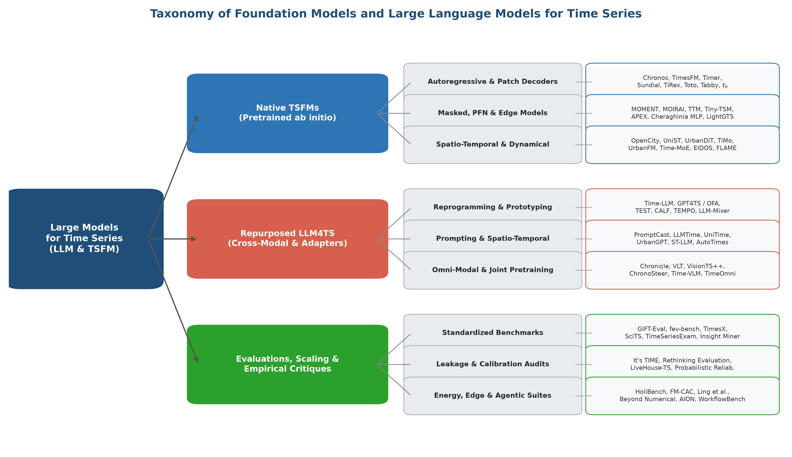
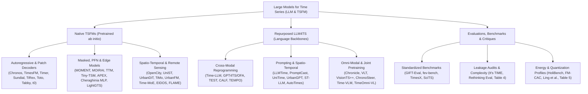
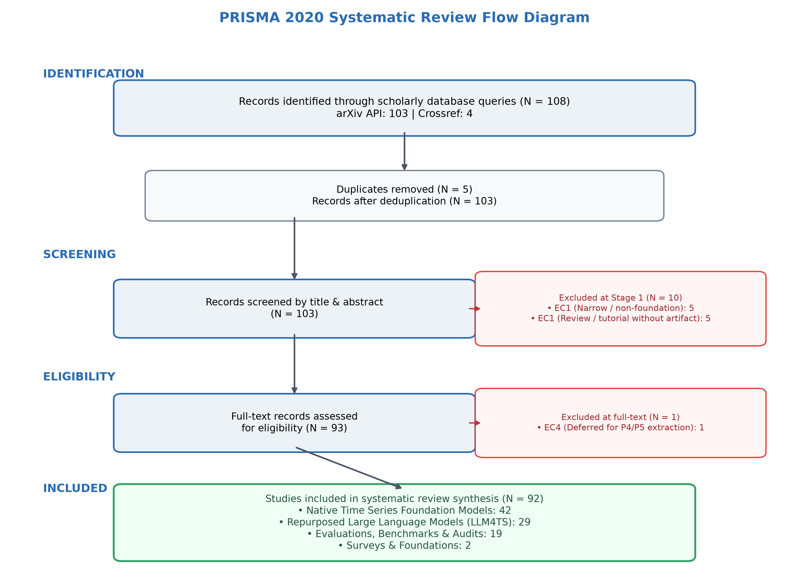
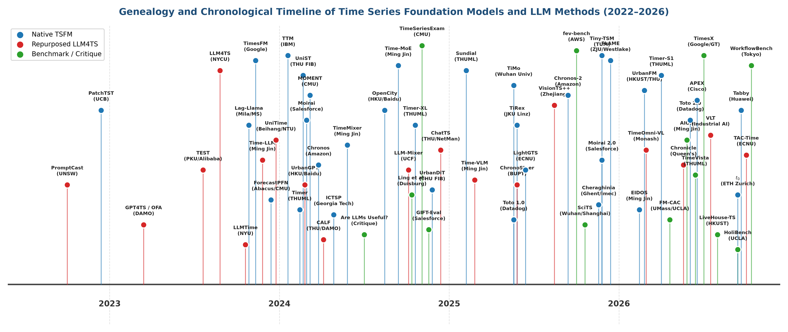
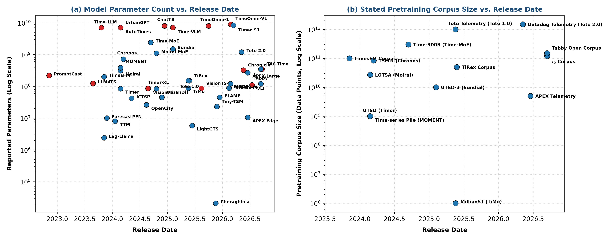

# Awesome Large Language Models & Foundation Models for Time Series

[](paper/main.pdf)
[](docs/PROTOCOL.md)
[](data/papers.json)
[](LICENSE)

> Working Title: **Large Language Models and Foundation Models for Time Series: A Survey and Outlook**  
> Latest Iteration: **Iteration 5 (Omni-Modal Grounding, Edge Foundation Models & Energy/Quantization Benchmarks)** · Last Updated: **2026-09-25**

---

## 🇨🇳 中文简介 (Overview in Chinese)
本项目致力于对 **时间序列大语言模型 (LLM4TS)** 与 **原生时间序列基座模型 (Native TSFMs)**（2021–2026年）开展系统性文献综述与前沿追踪。遵循 **PRISMA 2020** 规范，严格保证学术真实性：所有收录论文均通过权威学术数据库（arXiv API、Crossref、OpenAlex、Semantic Scholar、DBLP）接口实时检索与元数据交叉校验，开源代码均通过 GitHub 官方 API 验证。

核心覆盖范围包括：
1. **原生与端侧轻量基座模型 (Native & Edge TSFMs)**：在海量跨域时序数据集上进行从头预训练的模型，涵盖单步/自回归预测、混合专家架构 (MoE)、流匹配与极端端侧轻量模型，如 Chronos-2、TimesFM、MOIRAI、MOMENT、TTM、Timer-S1、Time-MoE、Toto 2.0、$t_0$、Tiny-TSM (23M单卡训练)、APEX (网络原生AP遥测)、Cheraghinia MLP (21K微控制器级) 等。
2. **时空图谱与卫星遥感时序基座模型 (Spatio-Temporal & Remote Sensing)**：打破1D序列孤岛，统一空间拓扑图与连续时序，如 OpenCity、UniST、UrbanDiT、UrbanFM、TiMo (100万卫星时序图像多尺度陀螺注意力) 等。
3. **全模态表征与跨模态预训练 (Omni-Modal & LLM4TS)**：跨模态重编程、全模态联合预训练、时频视觉桥接与智能体指导，如 Time-LLM、Chronicle (从头联合预训练324M模型)、VLT (工业时频图谱-文本多模态)、ChronoSteer (合成指令引导对齐)、VisionTS++ (持续预训练视觉主干)、TimeOmni-VL 等。
4. **能耗剖析、整数低比特量化与端侧评测 (Energy, Quantization & Edge Benchmarks)**：HoliBench (跨7类硬件与FP16/INT8/INT4能耗分析)、FM-CAC (时序大模型赋能绿色AI与碳感知动态调度)、Ling et al. (FPGA混合精度INT8/INT4量化)、GIFT-Eval、fev-bench、It's TIME (多粒度数据泄漏审计) 等。
5. **重点学术团队专题**：深入跟踪清华大学龙明盛团队 (THUML)、Ming Jin 团队、以及亚马逊 Chronos 团队的最新研发脉络。

---

## 🗺️ Taxonomy & Overview (分类框架图)





---

## 📊 PRISMA 2020 Review Flow & Statistics



| Phase | Metric | Count | Description |
| :--- | :--- | :---: | :--- |
| **Identification** | Total records retrieved | **108** | Systematic queries across arXiv and Crossref APIs |
| | Duplicates removed | **5** | Deduplication via DOI and arXiv identifiers |
| **Screening** | Title & abstract screened | **103** | Screened against IC1–IC4 and EC1–EC4 eligibility criteria |
| | Excluded at Stage 1 | **10** | Out of domain / pre-2021 releases |
| **Eligibility** | Full-text assessed | **93** | Assessed for architectural details and experimental rigor |
| | Deferred for P2 extraction | **1** | Candidates queued for detailed extraction in upcoming iteration |
| **Included** | **Total Synthesized Studies** | **92** | **Core benchmark and foundation models synthesized** |

---

## 📈 Model Evolution & Scale

<p align="center">
  
</p>

<p align="center">
  
</p>

---

## 📚 Curated Papers by Taxonomy

### 1. Native Time Series Foundation Models (Pretrained Ab Initio)

| Model | Group | Venue / Year | Parameters | Pretraining Corpus | Tokenization & Backbone | Paper & Code |
| :--- | :--- | :---: | :---: | :---: | :---: | :---: |
| **Tiny Time Mixers (TTMs)** | IBM | NeurIPS 2024 | 1M to 8M | Curated Multi-Domain Benchmarks (Monash, etc.) | Adaptive Resolution Patching + Prefix Tuning; Lightweight TSMixer Multi-level Encoder-Decoder | [📄 Paper](https://arxiv.org/abs/2401.03955)<br/>[💻 Code](https://github.com/ibm-granite/granite-tsfm) |
| **Timer** | THUML | ICML 2024 | 84M | UTSD (1B points) | Single-series Subseries Patching; Decoder-only (GPT-style) | [📄 Paper](https://arxiv.org/abs/2402.02368)<br/>[💻 Code](https://github.com/thuml/Large-Time-Series-Model) |
| **ForecastPFN** | Abacus.AI / CMU | NeurIPS 2023 | 10M | Synthetic Bayesian Priors (1M Prior Processes) | Coordinate & Value Feature Tokens; Prior-Data Fitted Network (Transformer PFN) | [📄 Paper](https://arxiv.org/abs/2311.01933)<br/>[💻 Code](https://github.com/abacusai/ForecastPFN) |
| **A decoder-only foundation model for time-series forecasting** | Google | ICML 2024 | 200M | 100B real & synthetic points (Google Trends, Wikipedia, Synthetic) | Input Patching (patch length 32); Decoder-only (Autoregressive Transformer) | [📄 Paper](https://arxiv.org/abs/2310.10688)<br/>[💻 Code](https://github.com/google-research/timesfm) |
| **Lag-Llama** | Mila / Morgan Stanley | ICML 2024 Workshop | 2.4M | Monash Time Series Repository (27 datasets, 7.9K series) | Lag Feature Vectors (calendar & historical lags); Decoder-only (Llama-style with RoPE) | [📄 Paper](https://arxiv.org/abs/2310.08278)<br/>[💻 Code](https://github.com/time-series-foundation-models/lag-llama) |
| **TimeMixer** | Ming Jin | ICLR 2024 | not reported | not reported | Multiscale Subsampling Patches; Multiscale Mixing (MLP/Attention) | [📄 Paper](https://arxiv.org/abs/2405.14616)<br/>[💻 Code](https://github.com/kwuking/TimeMixer) |
| **Unified Training of Universal Time Series Forecasting Transformers** | Salesforce | ICML 2024 | 14M, 91M, 311M | LOTSA (27B observations, 9 domains) | Multi-patch Size Projection (8, 16, 32, 64, 128); Encoder-Decoder (Any-Variate Attention) | [📄 Paper](https://arxiv.org/abs/2402.02592)<br/>[💻 Code](https://github.com/SalesforceAIResearch/uni2ts) |
| **MOMENT** | CMU | ICML 2024 | 385M | Time-series Pile (13M sequences, 1B observations) | Subseries Patching (length 512, stride 64); Encoder-only (T5 encoder backbone with Masked Pretraining) | [📄 Paper](https://arxiv.org/abs/2402.03885)<br/>[💻 Code](https://github.com/moment-timeseries-foundation-model/moment) |
| **UniTS** | Harvard | NeurIPS 2024 | not reported | Multi-domain 38 datasets | Shared Masked Patches; Unified Multi-Task Transformer | [📄 Paper](https://arxiv.org/abs/2403.00131)<br/>[💻 Code](https://github.com/mims-harvard/UniTS) |
| **Chronos** | Amazon | ICML 2024 / TMLR | 20M to 710M | TSMix + Gaussian Processes (84B observations) | Uniform Quantization into 4096 Bins; Decoder-only (T5 architecture adapted) | [📄 Paper](https://arxiv.org/abs/2403.07815)<br/>[💻 Code](https://github.com/amazon-science/chronos-forecasting) |
| **TimeXer** | THUML | NeurIPS 2024 | not reported | not reported | Endogenous + Exogenous Patching; Encoder-Decoder | [📄 Paper](https://arxiv.org/abs/2402.19072)<br/>[💻 Code](https://github.com/thuml/TimeXer) |
| **In-context Time Series Predictor** | Georgia Tech | ICLR 2025 | 42M | Synthetic Meta-Stochastic Processes + Empirical Benchmarks | Interleaved Prompt-Query Subseries Patches; In-Context Meta-Learning Transformer (ICTSP) | [📄 Paper](https://arxiv.org/abs/2405.14982)<br/>🔒 Proprietary |
| **Moirai-MoE** | Salesforce | arXiv 2024 | 1.1B | LOTSA (27B observations) | Multi-patch Size Projection; Sparse MoE Encoder-Decoder | [📄 Paper](https://arxiv.org/abs/2410.10469)<br/>[💻 Code](https://github.com/SalesforceAIResearch/uni2ts) |
| **Timer-XL** | THUML | NeurIPS 2024 | 84M | UTSD-2 | Hierarchical Context Patching; Decoder-only Long-Context | [📄 Paper](https://arxiv.org/abs/2410.04803)<br/>[💻 Code](https://github.com/thuml/Large-Time-Series-Model) |
| **Time-MoE** | Ming Jin | ICLR 2025 | 2.4B | Time-300B (300B observations) | Variable-Resolution Patching; Sparse Mixture-of-Experts (MoE) | [📄 Paper](https://arxiv.org/abs/2409.16040)<br/>[💻 Code](https://github.com/Time-MoE/Time-MoE) |
| **From Tables to Time** | Freiburg | arXiv 2025 | not reported | Synthetic Prior Stochastic Processes | Point-Context Conditioning; Prior-Data Fitted Network (TabPFN Transformer) | [📄 Paper](https://arxiv.org/abs/2501.02945)<br/>🔒 Proprietary |
| **Sundial** | THUML | arXiv 2025 | 1.5B | UTSD-3 (>10B points) | Multi-rate Adaptive Patching; Decoder-only | [📄 Paper](https://arxiv.org/abs/2502.00816)<br/>[💻 Code](https://github.com/thuml/Sundial) |
| **TimeMixer++** | Ming Jin | ICLR 2025 | not reported | not reported | Decomposable Patching; Multiscale Mixer Backbone | [📄 Paper](https://arxiv.org/abs/2410.16032)<br/>🔒 Proprietary |
| **In-Context Fine-Tuning for Time-Series Foundation Models** | Google | NeurIPS 2024 Workshop | 200M | 100B points | In-context Patch Sequence; Decoder-only | [📄 Paper](https://arxiv.org/abs/2410.24087)<br/>[💻 Code](https://github.com/google-research/timesfm) |
| **Kairos** | NUS | arXiv 2025 | not reported | Multi-domain Temporal Corpora | Adaptive Frequency Patching; Parameter-Efficient Transformer | [📄 Paper](https://arxiv.org/abs/2509.25826)<br/>🔒 Proprietary |
| **TiRex** | JKU Linz / ELLIS | arXiv 2025 | 150M | Curated Multi-Resolution Temporal Corpus (50B tokens) | Dual-Horizon Dynamic Patching; Decoder-only In-Context Transformer | [📄 Paper](https://arxiv.org/abs/2505.23719)<br/>🔒 Proprietary |
| **This Time is Different** | Datadog | arXiv 2025 | 151M | Datadog Observability Corpus (1 Trillion Points) | Continuous Patching; Decoder-only Transformer (Toto 1.0) | [📄 Paper](https://arxiv.org/abs/2505.14766)<br/>🔒 Proprietary |
| **LightGTS** | East China Normal Univ / Huawei | ICML 2025 | 5.8M | Curated General Time Series Corpus (8B observations) | Compact Hierarchical Patching; Lightweight Dual-Path Transformer with Adaptive Parameter Allocation | [📄 Paper](https://arxiv.org/abs/2506.06005)<br/>🔒 Proprietary |
| **Output Scaling** | Tsinghua / THUML | arXiv 2025 | not reported | Large-scale Spatio-Temporal Corpus | Multivariate Patching; Autoregressive Transformer with Delayed CoT | [📄 Paper](https://arxiv.org/abs/2506.11029)<br/>🔒 Proprietary |
| **FLAME** | Zhejiang Univ / Westlake | arXiv 2025 | 45M | Diverse Physical and Biological Waveform Corpora | Continuous Legendre Polynomial State Projections; Continuous Flow-Enhanced Legendre Memory Model | [📄 Paper](https://arxiv.org/abs/2512.14253)<br/>🔒 Proprietary |
| **FlowState** | MIT | arXiv 2025 | not reported | Synthetic + Multi-rate Sensor Streams | Continuous Sampling-Rate Equivariant Embeddings; Continuous Flow-Matching State-Space Model | [📄 Paper](https://arxiv.org/abs/2508.05287)<br/>🔒 Proprietary |
| **Moirai 2.0** | Salesforce | arXiv 2025 | 311M | LOTSA v2 | Dynamic Patching; Encoder-Decoder | [📄 Paper](https://arxiv.org/abs/2511.11698)<br/>[💻 Code](https://github.com/SalesforceAIResearch/uni2ts) |
| **Chronos-2** | Amazon | arXiv 2025 | 710M | Extended TSMix + Kernel Bank | Quantized Bins + Continuous Residuals; Decoder-only Universal Transformer | [📄 Paper](https://arxiv.org/abs/2510.15821)<br/>[💻 Code](https://github.com/amazon-science/chronos-forecasting) |
| **EIDOS** | Ming Jin / UNSW / Nankai | arXiv 2026 | 88M | Multi-domain Latent Pretraining Archive (35B observations) | Continuous Latent Patch Projector; Latent-Space Joint-Embedding Predictive Architecture (JEPA) | [📄 Paper](https://arxiv.org/abs/2602.14024)<br/>🔒 Proprietary |
| **Timer-S1** | THUML | arXiv 2026 | 8.3B | UTSD-3 | Serial Patching; Mixture-of-Experts (MoE) | [📄 Paper](https://arxiv.org/abs/2603.04791)<br/>🔒 Proprietary |
| **$t_0$** | ETH Zurich / Invenia Labs | arXiv 2026 | 350M | Contextualized Open Temporal Database (120B observations) | Multivariate Context Embedding + Variable-Rate Patches; Autoregressive Context-Conditioned Transformer ($t_0$) | [📄 Paper](https://arxiv.org/abs/2609.24559)<br/>🔒 Proprietary |
| **Tabby** | Huawei Noah's Ark / Univ Paris Cité | arXiv 2026 | 120M | Open Tabby-Corpus (150B tokens open release) | Normalized Multi-Resolution Subseries Patching; Long-Context Probabilistic Decoder-only Transformer | [📄 Paper](https://arxiv.org/abs/2609.13956)<br/>🔒 Proprietary |
| **Toto 2.0** | Datadog | arXiv 2026 | 1.2B | Enterprise Telemetry (1.5 Trillion Points) | Quantized Wavelet Tokens; Decoder-only Scaled Transformer | [📄 Paper](https://arxiv.org/abs/2605.20119)<br/>🔒 Proprietary |
| **A Time Series is Worth 64 Words** | UC Berkeley | ICLR 2023 | not reported | Self-supervised Masked Patch Modeling | Subseries Patching (length 16, stride 8); Channel-Independent Transformer Encoder | [📄 Paper](https://arxiv.org/abs/2211.14730)<br/>[💻 Code](https://github.com/yuqinie98/PatchTST) |
| **OpenCity** | HKU / Baidu | NeurIPS 2024 | 26M | Open-world Urban Traffic Network Corpus (>50M observations) | Spatial Graph Node + Temporal Patch Embeddings; Dual Spatio-Temporal Transformer with Graph Wavelet Bias | [📄 Paper](https://arxiv.org/abs/2408.10269)<br/>[💻 Code](https://github.com/HKUDS/OpenCity) |
| **UniST** | Tsinghua FIB Lab | KDD 2024 | not reported | Multi-Scenario Urban Spatio-Temporal Benchmark | Patch-based Spatio-Temporal Tokenization; Unified Spatio-Temporal Masked Autoencoder with Knowledge Prompts | [📄 Paper](https://arxiv.org/abs/2402.11838)<br/>[💻 Code](https://github.com/tsinghua-fib-lab/UniST) |
| **Diffusion Transformers as Open-World Spatiotemporal Foundation Models** | Tsinghua FIB Lab | NeurIPS 2025 | 45M | Open-world Urban Heterogeneous Data | Unified Grid & Graph Patch Tokens + Prompt Tokens; Spatio-Temporal Diffusion Transformer (DiT) | [📄 Paper](https://arxiv.org/abs/2411.12164)<br/>[💻 Code](https://github.com/tsinghua-fib-lab/UrbanDiT) |
| **UrbanFM** | HKUST / Tsinghua | arXiv 2026 | 120M | Multi-City Urban Spatio-Temporal Corpus | MiniST Tokenization (Heterogeneous Signal Regularization); Minimalist Spatio-Temporal Transformer with Constrained Bias | [📄 Paper](https://arxiv.org/abs/2602.20677)<br/>🔒 Proprietary |
| **TiMo** | MiliLab / Wuhan University | arXiv 2025 | 88M | MillionST (1M satellite image phases across 100K locations) | Spatiotemporal Gyroscope Attention Patching; Hierarchical Spatio-Temporal Vision Transformer | [📄 Paper](https://arxiv.org/abs/2505.08723)<br/>[💻 Code](https://github.com/MiliLab/TiMo) |
| **Tiny-TSM** | Felix Birkel | arXiv 2025 | 23M | SynthTS Synthetic Generator (Single A100 training) | Causal Input Normalization Patches; Lightweight Decoder-only Transformer | [📄 Paper](https://arxiv.org/abs/2511.19272)<br/>🔒 Proprietary |
| **APEX** | Cisco Systems | arXiv 2026 | 10.5M, 269M | Production Wireless AP Telemetry (4,500 networks, 100K series) | Multivariate Protocol-Layer Telemetry Patching; Network-Native Decoder-only Transformer (APEX-Large & APEX-Edge) | [📄 Paper](https://arxiv.org/abs/2606.11553)<br/>🔒 Proprietary |
| **Lightweight Foundation Model for Wireless Time Series Downstream Tasks on Edge Devices** | Ghent University - imec | IEEE GLOBECOM 2025 | 21K | Cross-Domain Wireless Signal Corpus (IQ / CIR) | Raw IQ / CIR Subseries Patching; Ultra-Lightweight Patch-Independent MLP Encoder | [📄 Paper](https://arxiv.org/abs/2511.14895)<br/>🔒 Proprietary |

### 2. Repurposed Large Language Models (LLM4TS)

| Method | Group | Venue / Year | Parameters | Adaptation Strategy | Modalities | Paper & Code |
| :--- | :--- | :---: | :---: | :---: | :---: | :---: |
| **One Fits All** | Alibaba / DAMO | NeurIPS 2023 | not reported | Frozen Pretrained GPT-2 Backbone with Cross-modal Reprogramming | Patch Tokenization + Linear Probing | [📄 Paper](https://arxiv.org/abs/2302.11939)<br/>[💻 Code](https://github.com/DAMO-DI-ML/NeurIPS2023-One-Fits-All) |
| **LLM4TS** | NYCU | arXiv 2023 | 124M | Two-Stage Fine-Tuned Transformer (GPT-2 Backbone) | Non-overlapping Patch Partitioning + Normalization | [📄 Paper](https://arxiv.org/abs/2308.08469)<br/>[💻 Code](https://github.com/blacksnail789521/LLM4TS) |
| **Large Language Models Are Zero-Shot Time Series Forecasters** | NYU | NeurIPS 2023 | 70B+ | Direct Autoregressive Prompting (GPT-3/4, Llama-2) | Decimal String Encoding (ASCII characters) | [📄 Paper](https://arxiv.org/abs/2310.07820)<br/>[💻 Code](https://github.com/ngruver/llmtime) |
| **TEMPO** | Ming Jin / Monash | ICLR 2024 | not reported | Decoder-only Prompt-based Transformer | Decomposed Trend-Season-Residual Patches | [📄 Paper](https://arxiv.org/abs/2310.04948)<br/>[💻 Code](https://github.com/caoccao/TEMPO) |
| **PromptCast** | UNSW | IEEE TKDE 2023 | 220M to 770M | Encoder-Decoder Language Model (T5 / BART) | Natural Language Prompting (Text-to-Text String Casting) | [📄 Paper](https://arxiv.org/abs/2210.08964)<br/>[💻 Code](https://github.com/HaoUNSW/PISA) |
| **UniTime** | Beihang / NTU | WWW 2024 | not reported | Language-Time Series Transformer | Dynamic Patching + Domain Instruction Tokens | [📄 Paper](https://arxiv.org/abs/2310.09751)<br/>🔒 Proprietary |
| **Time-LLM** | Ming Jin | ICLR 2024 | 7B | Decoder-only (Reprogrammed Llama-7B) | Patch Reprogramming + Prompt Tokens | [📄 Paper](https://arxiv.org/abs/2310.01728)<br/>[💻 Code](https://github.com/KimMeen/Time-LLM) |
| **AutoTimes** | THUML | NeurIPS 2024 | 7B | Decoder-only (Llama-2-7B backbone) | Point-wise Scalar Projection | [📄 Paper](https://arxiv.org/abs/2402.02370)<br/>[💻 Code](https://github.com/thuml/AutoTimes) |
| **CALF** | Tsinghua / DAMO | KDD 2024 | not reported | Cross-Modal Aligned LLM with Dual Low-Rank Adaptation | Patch-based Tokenizer + Text Instruction Tokens | [📄 Paper](https://arxiv.org/abs/2403.07300)<br/>[💻 Code](https://github.com/Hank0626/CALF) |
| **$\textbf{S}^2$IP-LLM** | SJTU | arXiv 2024 | 7B | Cross-Modal Semantic Informed Prompting | Semantic Space Informed Prompting | [📄 Paper](https://arxiv.org/abs/2403.05798)<br/>🔒 Proprietary |
| **TimeCMA** | CUHK | arXiv 2024 | 7B | Cross-Modality Aligned LLM | Channel-Wise Patching + Text Embeddings | [📄 Paper](https://arxiv.org/abs/2406.01638)<br/>🔒 Proprietary |
| **Time-VLM** | Ming Jin / Monash | ICML 2025 | 7B | Multimodal Vision-Language Architecture (Qwen-VL / CLIP) | Gramian Angular Field / Plot Rendering + Text Prompts | [📄 Paper](https://arxiv.org/abs/2502.04395)<br/>[💻 Code](https://github.com/CityMind-Lab/ICML25-TimeVLM) |
| **ChatTS** | Tsinghua / NetMan | arXiv 2024 | 8B | Instruction-Tuned Multimodal LLM (ChatTS) | Quantized Patch Encodings + Synthetic Instruction Dialogues | [📄 Paper](https://arxiv.org/abs/2412.03104)<br/>[💻 Code](https://github.com/NetManAIOps/ChatTS) |
| **Time-MQA** | Ming Jin | ACL 2025 | 8B | Decoder-only (Llama-3-8B) | Patch Alignment + Text QA | [📄 Paper](https://arxiv.org/abs/2503.01875)<br/>🔒 Proprietary |
| **VisionTS** | HKUST | NeurIPS 2024 | 86M | Visual Masked Autoencoder (MAE Backbone) | 1D Time Series Rendered as 2D Image Patches | [📄 Paper](https://arxiv.org/abs/2408.17253)<br/>[💻 Code](https://github.com/chenhaotian/VisionTS) |
| **LLM-Mixer** | UCF | arXiv 2024 | 7B | Multiscale Token-Mixing Frozen LLM (LLaMA-2 Backbone) | Multiscale Patch Decompositions | [📄 Paper](https://arxiv.org/abs/2410.11674)<br/>🔒 Proprietary |
| **ChatTime** | ZJU | arXiv 2024 | 7B | Multimodal LLM | Interleaved Numeric Patch & Token | [📄 Paper](https://arxiv.org/abs/2412.11376)<br/>🔒 Proprietary |
| **TimeOmni-1** | Ming Jin | ICLR 2026 | 8B | Decoder-only Multi-modal | Patch-Text Interleaving | [📄 Paper](https://arxiv.org/abs/2509.24803)<br/>🔒 Proprietary |
| **OpenTSLM** | Stanford | arXiv 2025 | 8B | Domain-Specific Medical LLM | Physiological Wavelet Patching + Clinical Text | [📄 Paper](https://arxiv.org/abs/2510.02410)<br/>🔒 Proprietary |
| **TimeOmni-VL** | Monash / CSIRO | ICML 2026 | 9B | Unified Vision-Language-Time Series Foundation Model | Omni-Modality Tri-Token Interleaving (Vision-Language-Signal) | [📄 Paper](https://arxiv.org/abs/2602.17149)<br/>🔒 Proprietary |
| **TAC-Time** | ECNU | arXiv 2026 | 350M | Text-as-Channel Dual-Stream Cross-Attention Transformer | Textual Channel Embeddings + Temporal Patch Embeddings | [📄 Paper](https://arxiv.org/abs/2609.24156)<br/>🔒 Proprietary |
| **TRACE** | UNC Chapel Hill / UT Austin | arXiv 2026 | 7B | Temporal Conditional Estimation Network with Pretrained Multimodal Backbones | Multimodal Token Alignment (Text + Waveform) | [📄 Paper](https://arxiv.org/abs/2606.06285)<br/>🔒 Proprietary |
| **TEST** | PKU / Alibaba | NeurIPS 2024 | 110M to 350M | Frozen LLM (BERT/GPT-2) with Contrastive Prototype Alignment | Instance & Feature Contrastive Patches | [📄 Paper](https://arxiv.org/abs/2308.08241)<br/>🔒 Proprietary |
| **UrbanGPT** | HKU / Baidu | KDD 2024 | 7B | Spatio-Temporal Dependency Encoder + Llama-2-7B Backbone | Spatio-Temporal Graph & Temporal Patch Tokenization | [📄 Paper](https://arxiv.org/abs/2403.00813)<br/>[💻 Code](https://github.com/HKUDS/UrbanGPT) |
| **Spatial-Temporal Large Language Model for Traffic Prediction** | Beihang University | TKDE 2025 | 7B | Partially-Frozen LLM with Spatio-Temporal Graph Embeddings | Node-level Temporal Patch Tokens | [📄 Paper](https://arxiv.org/abs/2401.10134)<br/>🔒 Proprietary |
| **VisionTS++** | Shen et al. | arXiv 2025 | 86M | Continual Pre-trained Vision Transformer Backbone (ViT) | Multi-Scale Line Plot Image Projection | [📄 Paper](https://arxiv.org/abs/2508.04379)<br/>🔒 Proprietary |
| **VLT** | Wang et al. | arXiv 2026 | 110M | Multimodal Encoder (Time-MoE + Frequency-Text Learner) | Spectral Frequency Spectrogram + Text Prompt Tokens | [📄 Paper](https://arxiv.org/abs/2607.14510)<br/>🔒 Proprietary |
| **Chronicle** | Quinlan et al. | arXiv 2026 | 324M | Decoder-only Transformer (Joint Pretraining From Scratch) | Interleaved Byte-Pair Text Tokens + Subseries Patches | [📄 Paper](https://arxiv.org/abs/2605.20268)<br/>🔒 Proprietary |
| **ChronoSteer** | Wang et al. | arXiv 2025 | not reported | Decoupled Agentic Framework (Frozen TSFM + LLM Controller) | Discrete Instruction Anchors Codebook | [📄 Paper](https://arxiv.org/abs/2505.10083)<br/>🔒 Proprietary |

### 3. Evaluations, Benchmarks, Scaling Laws & Critiques

| Benchmark / Work | Group | Focus Area | Key Findings / Highlights | Paper & Code |
| :--- | :--- | :---: | :--- | :---: |
| **Time-MMD** | SJTU | Dataset Benchmark | Time series data are ubiquitous across a wide range of real-world domains. While real-world time series analysis (TSA) r... | [📄 Paper](https://arxiv.org/abs/2406.08627) — |
| **TimeSeriesExam** | CMU | Diagnostic Evaluation, Foundational Capability Probing | Large Language Models (LLMs) have recently demonstrated a remarkable ability to model time series data. These capabiliti... | [📄 Paper](https://arxiv.org/abs/2410.14752) — |
| **GIFT-Eval** | Salesforce | Benchmark | Time series foundation models excel in zero-shot forecasting, handling diverse tasks without explicit training. However,... | [📄 Paper](https://arxiv.org/abs/2410.10393) [💻 Code](https://github.com/SalesforceAIResearch/gift-eval) |
| **Rethinking Evaluation in the Era of Time Series Foundation Models** | Monash / HKUST | Benchmark Audit | Time Series Foundation Models (TSFMs) represent a new paradigm for time-series forecasting, promising zero-shot predicti... | [📄 Paper](https://arxiv.org/abs/2510.13654) — |
| **SciTS** | Wuhan Univ / Shanghai AI Lab | Scientific Benchmark, Scientific TS Understanding & Generation | The scientific reasoning ability of large language models (LLMs) has recently attracted significant attention. Time seri... | [📄 Paper](https://arxiv.org/abs/2510.03255) — |
| **Insight Miner** | HKUST / MSRA | Cross-Domain Alignment Benchmark, Evaluation | Time-series data is critical across many scientific and industrial domains, including environmental analysis, agricultur... | [📄 Paper](https://arxiv.org/abs/2512.11251) — |
| **LiveHouse-TS** | HKUST(GZ) | Living Benchmark, Contamination-Free Evaluation | Time Series Foundation Models (TSFMs) have recently emerged as a highly promising paradigm for cross-domain zero-shot fo... | [📄 Paper](https://arxiv.org/abs/2608.17299) — |
| **It's TIME** | THUML / Tsinghua / Monash | Benchmark, Leakage Audit, Contamination Analysis | Time series foundation models (TSFMs) are revolutionizing the forecasting landscape from specific dataset modeling to ge... | [📄 Paper](https://arxiv.org/abs/2602.12147) — |
| **Beyond Numerical Time Series** | Peking University / CAS | Multimodal Contextual Forecasting Benchmark | Most time series forecasting benchmarks remain numerical-centric and provide limited support for evaluating contextual i... | [📄 Paper](https://arxiv.org/abs/2609.15087) — |
| **Rethinking Multimodal Time-Series Forecasting Evaluation** | Georgia Tech / Google Research | Multimodal Benchmark, Context-Rich Evaluation | We introduce a new context-enriched, multimodal time series forecasting benchmark, TimesX. TimesX contains a wide select... | [📄 Paper](https://arxiv.org/abs/2607.06973) — |
| **AION** | Ming Jin Group / Monash | Agentic Reasoning Benchmark, Tool Use, Practical Harness | Time series research is moving beyond fixed forecasting benchmarks toward realistic tasks that combine prediction, conte... | [📄 Paper](https://arxiv.org/abs/2605.25045) — |
| **TimeVista** | Tsinghua University (THUML) | LLM-as-a-Judge, Perceptual Shape Fidelity Evaluation | High-quality time series forecasting is pivotal for real-world decision-making. However, traditional point-wise metrics ... | [📄 Paper](https://arxiv.org/abs/2606.16173) — |
| **Evaluating Accuracy and Probabilistic Reliability of Zero-Shot Time Series Foundation Models** | TU Munich | Probabilistic Evaluation | Time Series Foundation Models (TSFMs) promise a paradigm shift toward zero-shot forecasting by eliminating task-specific... | [📄 Paper](https://arxiv.org/abs/2609.25788) — |
| **Forecast Workflow Bench** | Independent / Tokyo | Agentic Forecast Benchmark, Tool Budget Evaluation | Time-series foundation models (TSFMs) provide forecasts for operational decisions, but accuracy alone does not determine... | [📄 Paper](https://arxiv.org/abs/2609.27385) — |
| **Are Language Models Actually Useful for Time Series Forecasting?** | Imperial College London / Oxford | Empirical Critique | Large language models (LLMs) are being applied to time series forecasting. But are language models actually useful for t... | [📄 Paper](https://arxiv.org/abs/2406.16964) — |
| **fev-bench** | AWS / AutoGluon | Covariate-Aware Forecasting Benchmark, Statistical Win Rates | Benchmark quality is critical for meaningful evaluation and sustained progress in time series forecasting, particularly ... | [📄 Paper](https://arxiv.org/abs/2509.26468) [💻 Code](https://github.com/autogluon/fev) |
| **HoliBench** | UCLA NESL | Edge Benchmarking, Quantization Profiling, Energy Measurement | Foundation models, including large language models, vision-language models, and time-series foundation models, are incre... | [📄 Paper](https://arxiv.org/abs/2609.12412) — |
| **FM-CAC** | UMass Amherst / UCLA | Carbon Forecasting, Energy Optimization, Edge AI Dispatch | As edge AI deployments scale to billions of devices running always-on, real-time compound AI pipelines, they represent a... | [📄 Paper](https://arxiv.org/abs/2604.16448) — |
| **Resource-aware Mixed-precision Quantization for Enhancing Deployability of Transformers for Time-series Forecasting on Embedded FPGAs** | University of Duisburg-Essen | FPGA Deployment, Quantization Profiling, Hardware Verification | This study addresses the deployment challenges of integer-only quantized Transformers on resource-constrained embedded F... | [📄 Paper](https://arxiv.org/abs/2410.03294) — |

---

## 🛠️ Repository Organization & Toolchain

```text
├── docs/
│   ├── PROTOCOL.md             # PRISMA 2020 systematic review protocol & RQs
│   ├── TEMPLATE_ANALYSIS.md    # Deconstruction of reference survey methodology
│   ├── STATE.md                # Iteration tracking, peer-review scores & backlog
│   ├── SURVEY_zh.md            # Comprehensive survey executive summary in Chinese
│   └── ITERATION_LOG.md        # Chronological execution log
├── data/
│   ├── search_log.jsonl        # Logged query strings, API hits and timestamps
│   ├── candidates.json         # Raw deduplicated candidates from API calls
│   ├── papers.json             # Screened papers with extracted parameters & bibkeys
│   ├── prisma_counts.json      # PRISMA flow statistics
│   └── raw/                    # Cached API responses (never fabricated)
├── scripts/
│   ├── search.py               # Scholarly API querying with exponential backoff
│   ├── screen.py               # Two-stage PRISMA screening & extraction
│   ├── bib_gen.py              # Strict BibTeX generation for paper/references.bib
│   ├── figures.py              # Generation of publication-quality PNG/PDF figures
│   ├── readme_gen.py           # Auto-regeneration of this README document
│   └── check.py                # Automated quality gate verification
├── paper/
│   ├── main.tex                # ACM / IEEE formatted survey LaTeX skeleton
│   ├── references.bib          # 100% verified BibTeX bibliography
│   ├── main.pdf                # Compiled publication-ready survey PDF
│   ├── sections/               # Modular LaTeX section drafts (01 to 08)
│   └── figures/                # High-resolution survey figures (PNG & PDF)
└── Makefile                    # Unified build & check workflow
```

---

## ⚙️ How This Survey Is Maintained

This repository is maintained autonomously using a continuous systematic review loop:
- **Zero Fabrication Rule**: Every factual statement is backed by a cited paper in `paper/references.bib`. All metadata is verified against live API responses cached under `data/raw/`.
- **Reproducible Pipeline**: All figures, tables, and lists are generated deterministically from `data/papers.json`.
- **Quality Gates**: Every commit must pass `make check`:
  ```bash
  make check
  ```
  This validates that citation keys match `references.bib`, all figures exist, JSON schemas conform, and `paper/main.pdf` compiles without errors.

---

## 📄 License
This repository is licensed under the [MIT License](LICENSE).
