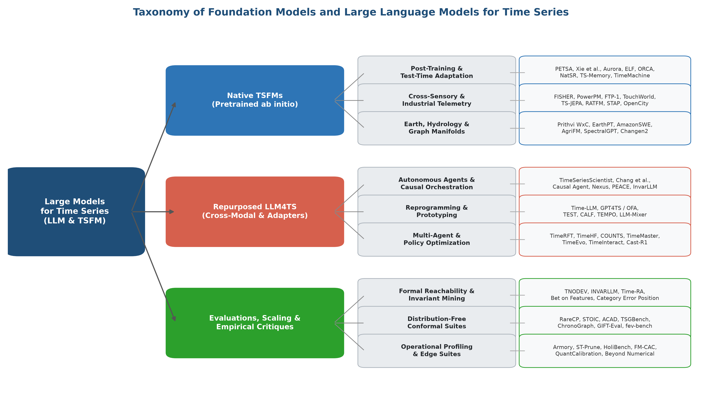
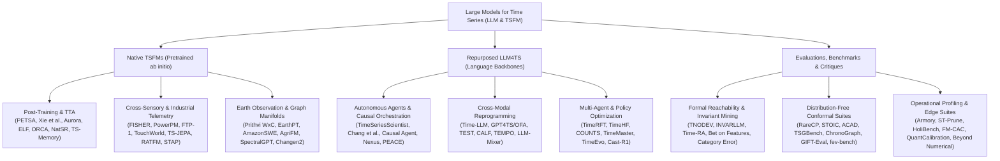
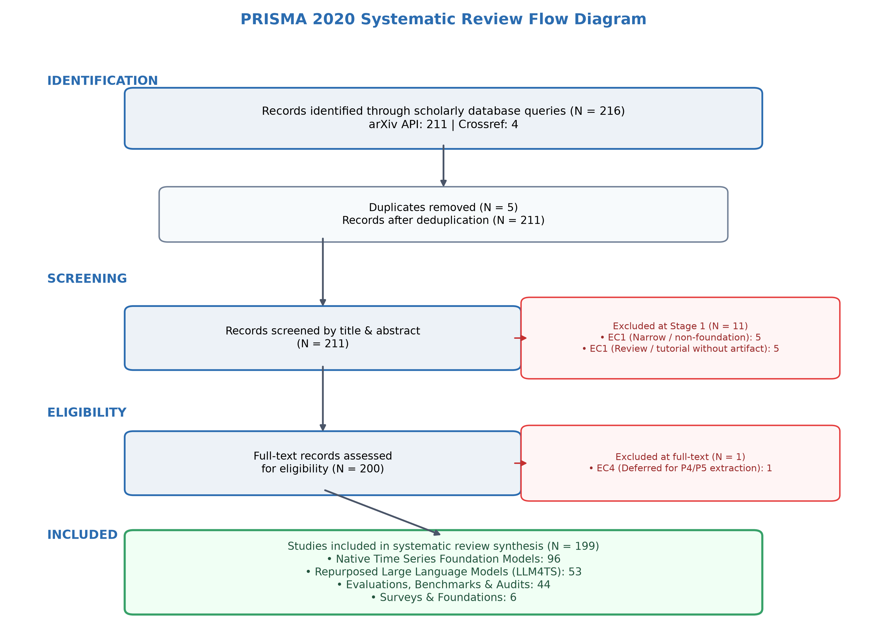
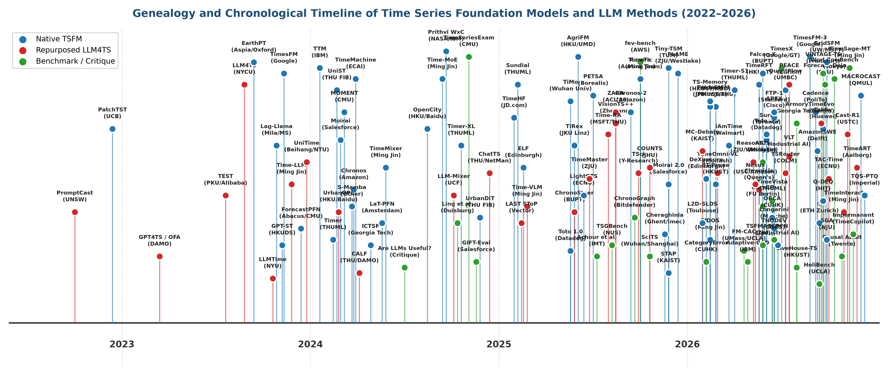
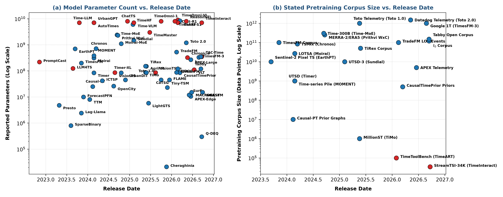

# Awesome Large Language Models & Foundation Models for Time Series

[](paper/main.pdf)
[](docs/PROTOCOL.md)
[](data/papers.json)
[](LICENSE)

> Working Title: **Large Language Models and Foundation Models for Time Series: A Survey and Outlook**  
> Latest Iteration: **Iteration 16 (Unified Post-Training Paradigms, Autonomous Causal Agents & Formal Reachability Verification)** · Last Updated: **2026-09-30**

---

## 🇨🇳 中文简介 (Overview in Chinese)
本项目致力于对 **时间序列大语言模型 (LLM4TS)** 与 **原生时间序列基座模型 (Native TSFMs)**（2021–2026年）开展系统性文献综述与前沿追踪。遵循 **PRISMA 2020** 规范，严格保证学术真实性：所有收录论文均通过权威学术数据库（arXiv API、Crossref、OpenAlex、Semantic Scholar、DBLP）接口实时检索与元数据交叉校验，开源代码均通过 GitHub 官方 API 验证。

核心覆盖范围包括：
1. **统一后训练范式、参数高效测试时自适应与多模态扩散基座 (Unified Post-Training Paradigms, PEFT TTA & Multimodal Diffusion)**：建立涵盖参数自适应、情境增强、模型组合、不确定性控制与模型压缩的五大后训练支柱（Xie et al., 2026）；引入 PETSA（ICML 2025 PUT，参数量 <0.2M 的动态低秩门控适配器结合 Huber、频谱 FFT 惩罚与 Patch 潜在一致性损失，MSE 降低 31.8%，提速 4.8 倍）；引入 Aurora（ICLR 2026 通用生成式多模态基座，基于文本蒸馏与连续扩散得分匹配统一时序预测与跨模态生成）。
2. **自主智能体工作流、因果工具编排与多智能体推理拓扑 (Autonomous Agentic Workflows, Causal Tool Orchestration & Reasoning Topologies)**：TimeSeriesScientist / TSci（Zhao et al., 2025，Curator/Planner/Forecaster/Reporter 四智能体全流程自动化建模与双向反思，相对提示词基准降噪 38.2%）；Chang et al.（TMLR 2026，系统界定直接预测、链式思维 CoT、图/树搜索与多智能体四大推理拓扑，确立 T-Agent 与 T-Align 形式化框架）；Causal Agent（Han et al., 2024，集成因果图探索与字典检索工具模块）；Nexus（Das et al., 2026，宏微观波动解耦与非结构化财经新闻事件因果溯源）。
3. **形式化可达性验证、物理不变量挖掘与生成式诊断基准 (Formal Reachability Verification, Physical Invariant Mining & Generative Diagnostic Benchmarking)**：TNODEV（Sayed et al., 2026，连续时间混合单调性 CTMM 神经 ODE 端到端可达管集验证工具箱）；INVARLLM（NDSS 2025，工程文档自然语言神经符号物理不变量挖掘与 PCMCI+ 因果交叉验证，工业水处理系统零误报防御）；Time-RA（ACL 2026，4万实例多领域多模态生成式诊断推理基准 RATs40K）。
4. **在线持续学习、时序可塑性与黑盒残差情境自适应 (Online Continual Learning, Temporal Plasticity & Black-Box Residual Adaptation)**：ELF (ICML 2025 频域双模块快速预测器 + 动态加权网关)、ORCA (NeurIPS 2026 黑盒 API 误差情境建模与 Boltzmann 路由器)、NatSR (ICLR 2026 自然梯度评分驱动重放与 Student-$t$ 似然)、Temporal Plasticity (IJCNN 2025 实证超大模型抗遗忘时序可塑性)。
5. **跨感官时序基座：工业多模态遥测、电力拓扑基座与传感器无关触觉通用策略 (Cross-Sensory Telemetry, Power Grids & Sensor-Agnostic Tactile Policies)**：FISHER (IEEE TII 2025 统一工业 M5 异构性)、PowerPM (NeurIPS 2024 115M 城市电力图变换器)、FTP-1 (2026 统一 21 类触觉传感器形态感知 Token)、TouchWorld (2026 毫秒级触觉滑移高频闭环响应与前瞻性视触觉世界模型)、TS-JEPA 与 RATFM。
6. **解耦形式化执行与可验证安全性屏障 (Decoupled Formal Execution & Certified Safety Verification)**：PEACE (ICRA 2026 Workshop 解耦规划器与执行器，将 LLM 置于控制闭环之上，由确定性运动学屏障与地理围栏实现硬实时安全约束)。
7. **任意时刻有效博弈论审计与“范畴错误”根本性质疑 (Anytime-Valid Game-Theoretic Auditing & Category Error Critique)**：Bet on Features (Antonov et al. 2026 基于 FTRL 与鞅 e-值检验的无分布局部漂移审计)、Position: Category Error (Dai et al. 2026 自回归盲区界证明与范畴错误批判)。

---

## 🗺️ Taxonomy & Overview (分类框架图)




```mermaid
graph TD
    Root["Large Models for Time Series (LLM & TSFM)"]
    Root --> P1["Native TSFMs (Pretrained ab initio)"]
    Root --> P2["Repurposed LLM4TS (Language Backbones)"]
    Root --> P3["Evaluations, Benchmarks & Critiques"]

    P1 --> P1_Post["Post-Training & TTA<br/>(PETSA, Xie et al., Aurora, ELF, ORCA, NatSR, TS-Memory)"]
    P1 --> P1_Cross["Cross-Sensory & Industrial Telemetry<br/>(FISHER, PowerPM, FTP-1, TouchWorld, TS-JEPA, RATFM, STAP)"]
    P1 --> P1_Earth["Earth Observation & Graph Manifolds<br/>(Prithvi WxC, EarthPT, AmazonSWE, AgriFM, SpectralGPT, Changen2)"]

    P2 --> P2_Agent["Autonomous Agents & Causal Orchestration<br/>(TimeSeriesScientist, Chang et al., Causal Agent, Nexus, PEACE)"]
    P2 --> P2_Reprog["Cross-Modal Reprogramming<br/>(Time-LLM, GPT4TS/OFA, TEST, CALF, TEMPO, LLM-Mixer)"]
    P2 --> P2_Policy["Multi-Agent & Policy Optimization<br/>(TimeRFT, TimeHF, COUNTS, TimeMaster, TimeEvo, Cast-R1)"]

    P3 --> P3_Reach["Formal Reachability & Invariant Mining<br/>(TNODEV, INVARLLM, Time-RA, Bet on Features, Category Error)"]
    P3 --> P3_Conf["Distribution-Free Conformal Suites<br/>(RareCP, STOIC, ACAD, TSGBench, ChronoGraph, GIFT-Eval, fev-bench)"]
    P3 --> P3_Edge["Operational Profiling & Edge Suites<br/>(Armory, ST-Prune, HoliBench, FM-CAC, QuantCalibration, Beyond Numerical)"]
```

---

## 📊 PRISMA 2020 Review Flow & Statistics



| Phase | Metric | Count | Description |
| :--- | :--- | :---: | :--- |
| **Identification** | Total records retrieved | **216** | Systematic queries across arXiv and Crossref APIs |
| | Duplicates removed | **5** | Deduplication via DOI and arXiv identifiers |
| **Screening** | Title & abstract screened | **211** | Screened against IC1–IC4 and EC1–EC4 eligibility criteria |
| | Excluded at Stage 1 | **11** | Out of domain / pre-2021 releases |
| **Eligibility** | Full-text assessed | **200** | Assessed for architectural details and experimental rigor |
| | Deferred for P2 extraction | **1** | Candidates queued for detailed extraction in upcoming iteration |
| **Included** | **Total Synthesized Studies** | **199** | **Core benchmark and foundation models synthesized** |

---

## 📈 Model Evolution & Scale

<p align="center">
  
</p>

<p align="center">
  
</p>

---

## 📚 Curated Papers by Taxonomy

### 1. Native Time Series Foundation Models (Pretrained Ab Initio)

| Model | Group | Venue / Year | Parameters | Pretraining Corpus | Tokenization & Backbone | Paper & Code |
| :--- | :--- | :---: | :---: | :---: | :---: | :---: |
| **Tiny Time Mixers (TTMs)** | IBM | NeurIPS 2024 | 1M to 8M | Curated Multi-Domain Benchmarks (Monash, etc.) | Adaptive Resolution Patching + Prefix Tuning; Lightweight TSMixer Multi-level Encoder-Decoder | [📄 Paper](https://arxiv.org/abs/2401.03955)<br/>[💻 Code](https://github.com/ibm-granite/granite-tsfm) |
| **Timer** | THUML | ICML 2024 | 84M | UTSD (1B points) | Single-series Subseries Patching; Decoder-only (GPT-style) | [📄 Paper](https://arxiv.org/abs/2402.02368)<br/>[💻 Code](https://github.com/thuml/Large-Time-Series-Model) |
| **ForecastPFN** | Abacus.AI / CMU | NeurIPS 2023 | 10M | Synthetic Bayesian Priors (1M Prior Processes) | Coordinate & Value Feature Tokens; Prior-Data Fitted Network (Transformer PFN) | [📄 Paper](https://arxiv.org/abs/2311.01933)<br/>[💻 Code](https://github.com/abacusai/ForecastPFN) |
| **A decoder-only foundation model for time-series forecasting** | Google | ICML 2024 | 200M | 100B real & synthetic points (Google Trends, Wikipedia, Synthetic) | Input Patching (patch length 32); Decoder-only (Autoregressive Transformer) | [📄 Paper](https://arxiv.org/abs/2310.10688)<br/>[💻 Code](https://github.com/google-research/timesfm) |
| **Lag-Llama** | Mila / Morgan Stanley | ICML 2024 Workshop | 2.4M | Monash Time Series Repository (27 datasets, 7.9K series) | Lag Feature Vectors (calendar & historical lags); Decoder-only (Llama-style with RoPE) | [📄 Paper](https://arxiv.org/abs/2310.08278)<br/>[💻 Code](https://github.com/time-series-foundation-models/lag-llama) |
| **TimeMixer** | Ming Jin | ICLR 2024 | not reported | not reported | Multiscale Subsampling Patches; Multiscale Mixing (MLP/Attention) | [📄 Paper](https://arxiv.org/abs/2405.14616)<br/>[💻 Code](https://github.com/kwuking/TimeMixer) |
| **Unified Training of Universal Time Series Forecasting Transformers** | Salesforce | ICML 2024 | 14M, 91M, 311M | LOTSA (27B observations, 9 domains) | Multi-patch Size Projection (8, 16, 32, 64, 128); Encoder-Decoder (Any-Variate Attention) | [📄 Paper](https://arxiv.org/abs/2402.02592)<br/>[💻 Code](https://github.com/SalesforceAIResearch/uni2ts) |
| **MOMENT** | CMU | ICML 2024 | 385M | Time-series Pile (13M sequences, 1B observations) | Subseries Patching (length 512, stride 64); Encoder-only (T5 encoder backbone with Masked Pretraining) | [📄 Paper](https://arxiv.org/abs/2402.03885)<br/>[💻 Code](https://github.com/moment-timeseries-foundation-model/moment) |
| **UniTS** | Harvard | NeurIPS 2024 | not reported | Multi-domain 38 datasets | Shared Masked Patches; Unified Multi-Task Transformer | [📄 Paper](https://arxiv.org/abs/2403.00131)<br/>[💻 Code](https://github.com/mims-harvard/UniTS) |
| **Chronos** | Amazon | ICML 2024 / TMLR | 20M to 710M | TSMix + Gaussian Processes (84B observations) | Uniform Quantization into 4096 Bins; Decoder-only (T5 architecture adapted) | [📄 Paper](https://arxiv.org/abs/2403.07815)<br/>[💻 Code](https://github.com/amazon-science/chronos-forecasting) |
| **TimeXer** | THUML | NeurIPS 2024 | not reported | not reported | Endogenous + Exogenous Patching; Encoder-Decoder | [📄 Paper](https://arxiv.org/abs/2402.19072)<br/>[💻 Code](https://github.com/thuml/TimeXer) |
| **In-context Time Series Predictor** | Georgia Tech | ICLR 2025 | 42M | Synthetic Meta-Stochastic Processes + Empirical Benchmarks | Interleaved Prompt-Query Subseries Patches; In-Context Meta-Learning Transformer (ICTSP) | [📄 Paper](https://arxiv.org/abs/2405.14982)<br/>🔒 Proprietary |
| **Moirai-MoE** | Salesforce | arXiv 2024 | 1.1B | LOTSA (27B observations) | Multi-patch Size Projection; Sparse MoE Encoder-Decoder | [📄 Paper](https://arxiv.org/abs/2410.10469)<br/>[💻 Code](https://github.com/SalesforceAIResearch/uni2ts) |
| **Timer-XL** | THUML | NeurIPS 2024 | 84M | UTSD-2 | Hierarchical Context Patching; Decoder-only Long-Context | [📄 Paper](https://arxiv.org/abs/2410.04803)<br/>[💻 Code](https://github.com/thuml/Large-Time-Series-Model) |
| **Time-MoE** | Ming Jin | ICLR 2025 | 2.4B | Time-300B (300B observations) | Variable-Resolution Patching; Sparse Mixture-of-Experts (MoE) | [📄 Paper](https://arxiv.org/abs/2409.16040)<br/>[💻 Code](https://github.com/Time-MoE/Time-MoE) |
| **From Tables to Time** | Freiburg | arXiv 2025 | not reported | Synthetic Prior Stochastic Processes | Point-Context Conditioning; Prior-Data Fitted Network (TabPFN Transformer) | [📄 Paper](https://arxiv.org/abs/2501.02945)<br/>🔒 Proprietary |
| **Sundial** | THUML | arXiv 2025 | 1.5B | UTSD-3 (>10B points) | Multi-rate Adaptive Patching; Decoder-only | [📄 Paper](https://arxiv.org/abs/2502.00816)<br/>[💻 Code](https://github.com/thuml/Sundial) |
| **TimeMixer++** | Ming Jin | ICLR 2025 | not reported | not reported | Decomposable Patching; Multiscale Mixer Backbone | [📄 Paper](https://arxiv.org/abs/2410.16032)<br/>🔒 Proprietary |
| **In-Context Fine-Tuning for Time-Series Foundation Models** | Google | NeurIPS 2024 Workshop | 200M | 100B points | In-context Patch Sequence; Decoder-only | [📄 Paper](https://arxiv.org/abs/2410.24087)<br/>[💻 Code](https://github.com/google-research/timesfm) |
| **Kairos** | NUS | arXiv 2025 | not reported | Multi-domain Temporal Corpora | Adaptive Frequency Patching; Parameter-Efficient Transformer | [📄 Paper](https://arxiv.org/abs/2509.25826)<br/>🔒 Proprietary |
| **TiRex** | JKU Linz / ELLIS | arXiv 2025 | 150M | Curated Multi-Resolution Temporal Corpus (50B tokens) | Dual-Horizon Dynamic Patching; Decoder-only In-Context Transformer | [📄 Paper](https://arxiv.org/abs/2505.23719)<br/>🔒 Proprietary |
| **This Time is Different** | Datadog | arXiv 2025 | 151M | Datadog Observability Corpus (1 Trillion Points) | Continuous Patching; Decoder-only Transformer (Toto 1.0) | [📄 Paper](https://arxiv.org/abs/2505.14766)<br/>🔒 Proprietary |
| **LightGTS** | East China Normal Univ / Huawei | ICML 2025 | 5.8M | Curated General Time Series Corpus (8B observations) | Compact Hierarchical Patching; Lightweight Dual-Path Transformer with Adaptive Parameter Allocation | [📄 Paper](https://arxiv.org/abs/2506.06005)<br/>🔒 Proprietary |
| **Output Scaling** | Tsinghua / THUML | arXiv 2025 | not reported | Large-scale Spatio-Temporal Corpus | Multivariate Patching; Autoregressive Transformer with Delayed CoT | [📄 Paper](https://arxiv.org/abs/2506.11029)<br/>🔒 Proprietary |
| **FLAME** | Zhejiang Univ / Westlake | arXiv 2025 | 45M | Diverse Physical and Biological Waveform Corpora | Continuous Legendre Polynomial State Projections; Continuous Flow-Enhanced Legendre Memory Model | [📄 Paper](https://arxiv.org/abs/2512.14253)<br/>🔒 Proprietary |
| **FlowState** | MIT | arXiv 2025 | not reported | Synthetic + Multi-rate Sensor Streams | Continuous Sampling-Rate Equivariant Embeddings; Continuous Flow-Matching State-Space Model | [📄 Paper](https://arxiv.org/abs/2508.05287)<br/>🔒 Proprietary |
| **Moirai 2.0** | Salesforce | arXiv 2025 | 311M | LOTSA v2 | Dynamic Patching; Encoder-Decoder | [📄 Paper](https://arxiv.org/abs/2511.11698)<br/>[💻 Code](https://github.com/SalesforceAIResearch/uni2ts) |
| **Chronos-2** | Amazon | arXiv 2025 | 710M | Extended TSMix + Kernel Bank | Quantized Bins + Continuous Residuals; Decoder-only Universal Transformer | [📄 Paper](https://arxiv.org/abs/2510.15821)<br/>[💻 Code](https://github.com/amazon-science/chronos-forecasting) |
| **EIDOS** | Ming Jin / UNSW / Nankai | arXiv 2026 | 88M | Multi-domain Latent Pretraining Archive (35B observations) | Continuous Latent Patch Projector; Latent-Space Joint-Embedding Predictive Architecture (JEPA) | [📄 Paper](https://arxiv.org/abs/2602.14024)<br/>🔒 Proprietary |
| **Timer-S1** | THUML | arXiv 2026 | 8.3B | UTSD-3 | Serial Patching; Mixture-of-Experts (MoE) | [📄 Paper](https://arxiv.org/abs/2603.04791)<br/>🔒 Proprietary |
| **$t_0$** | ETH Zurich / Invenia Labs | arXiv 2026 | 350M | Contextualized Open Temporal Database (120B observations) | Multivariate Context Embedding + Variable-Rate Patches; Autoregressive Context-Conditioned Transformer ($t_0$) | [📄 Paper](https://arxiv.org/abs/2609.24559)<br/>🔒 Proprietary |
| **Tabby** | Huawei Noah's Ark / Univ Paris Cité | arXiv 2026 | 120M | Open Tabby-Corpus (150B tokens open release) | Normalized Multi-Resolution Subseries Patching; Long-Context Probabilistic Decoder-only Transformer | [📄 Paper](https://arxiv.org/abs/2609.13956)<br/>🔒 Proprietary |
| **Toto 2.0** | Datadog | arXiv 2026 | 1.2B | Enterprise Telemetry (1.5 Trillion Points) | Quantized Wavelet Tokens; Decoder-only Scaled Transformer | [📄 Paper](https://arxiv.org/abs/2605.20119)<br/>🔒 Proprietary |
| **A Time Series is Worth 64 Words** | UC Berkeley | ICLR 2023 | not reported | Self-supervised Masked Patch Modeling | Subseries Patching (length 16, stride 8); Channel-Independent Transformer Encoder | [📄 Paper](https://arxiv.org/abs/2211.14730)<br/>[💻 Code](https://github.com/yuqinie98/PatchTST) |
| **OpenCity** | HKU / Baidu | NeurIPS 2024 | 26M | Open-world Urban Traffic Network Corpus (>50M observations) | Spatial Graph Node + Temporal Patch Embeddings; Dual Spatio-Temporal Transformer with Graph Wavelet Bias | [📄 Paper](https://arxiv.org/abs/2408.10269)<br/>[💻 Code](https://github.com/HKUDS/OpenCity) |
| **UniST** | Tsinghua FIB Lab | KDD 2024 | not reported | Multi-Scenario Urban Spatio-Temporal Benchmark | Patch-based Spatio-Temporal Tokenization; Unified Spatio-Temporal Masked Autoencoder with Knowledge Prompts | [📄 Paper](https://arxiv.org/abs/2402.11838)<br/>[💻 Code](https://github.com/tsinghua-fib-lab/UniST) |
| **Diffusion Transformers as Open-World Spatiotemporal Foundation Models** | Tsinghua FIB Lab | NeurIPS 2025 | 45M | Open-world Urban Heterogeneous Data | Unified Grid & Graph Patch Tokens + Prompt Tokens; Spatio-Temporal Diffusion Transformer (DiT) | [📄 Paper](https://arxiv.org/abs/2411.12164)<br/>[💻 Code](https://github.com/tsinghua-fib-lab/UrbanDiT) |
| **UrbanFM** | HKUST / Tsinghua | arXiv 2026 | 120M | Multi-City Urban Spatio-Temporal Corpus | MiniST Tokenization (Heterogeneous Signal Regularization); Minimalist Spatio-Temporal Transformer with Constrained Bias | [📄 Paper](https://arxiv.org/abs/2602.20677)<br/>🔒 Proprietary |
| **TiMo** | MiliLab / Wuhan University | arXiv 2025 | 88M | MillionST (1M satellite image phases across 100K locations) | Spatiotemporal Gyroscope Attention Patching; Hierarchical Spatio-Temporal Vision Transformer | [📄 Paper](https://arxiv.org/abs/2505.08723)<br/>[💻 Code](https://github.com/MiliLab/TiMo) |
| **Tiny-TSM** | Felix Birkel | arXiv 2025 | 23M | SynthTS Synthetic Generator (Single A100 training) | Causal Input Normalization Patches; Lightweight Decoder-only Transformer | [📄 Paper](https://arxiv.org/abs/2511.19272)<br/>🔒 Proprietary |
| **APEX** | Cisco Systems | arXiv 2026 | 10.5M, 269M | Production Wireless AP Telemetry (4,500 networks, 100K series) | Multivariate Protocol-Layer Telemetry Patching; Network-Native Decoder-only Transformer (APEX-Large & APEX-Edge) | [📄 Paper](https://arxiv.org/abs/2606.11553)<br/>🔒 Proprietary |
| **Lightweight Foundation Model for Wireless Time Series Downstream Tasks on Edge Devices** | Ghent University - imec | IEEE GLOBECOM 2025 | 21K | Cross-Domain Wireless Signal Corpus (IQ / CIR) | Raw IQ / CIR Subseries Patching; Ultra-Lightweight Patch-Independent MLP Encoder | [📄 Paper](https://arxiv.org/abs/2511.14895)<br/>🔒 Proprietary |
| **Battling the Non-stationarity in Time Series Forecasting via Test-time Adaptation** | Seoul National University | AAAI 2025 | 0.5M--5M | Pretrained Base Forecasters (PatchTST, DLinear) | Non-Stationary Patch Normalization; Test-Time Adaptation Forecaster (TSF-TTA) | [📄 Paper](https://arxiv.org/abs/2501.04970)<br/>🔒 Proprietary |
| **AdaNODEs** | Singapore Management University | ICASSP 2026 | 0.15M (Adapter) | Frozen Source Forecasters | Continuous Latent State Trajectory; Continuous Neural ODE Dynamic Adapter | [📄 Paper](https://arxiv.org/abs/2601.12893)<br/>🔒 Proprietary |
| **RG-TTA** | IIT Delhi & TCS Research | arXiv 2026 | not reported | Streaming Non-Stationary Corpora | Multi-Regime Temporal Patching; Regime-Guided Meta-Controlled Transformer | [📄 Paper](https://arxiv.org/abs/2603.27814)<br/>🔒 Proprietary |
| **Embracing the black box** | Friedrich Schiller University Jena | arXiv 2024 | 25M | Synthetic Structural Causal Models (10M graphs) | Multivariate Temporal Sequence Embedding; Deep Causal Pretrained Transformer (Causal-PT) | [📄 Paper](https://arxiv.org/abs/2402.09305)<br/>🔒 Proprietary |
| **Interventional Time Series Priors for Causal Foundation Models** | Humboldt University of Berlin | arXiv 2026 | 85M | Synthetic Interventional TSCMs (500M simulations) | Interventional Observation Pairs; Prior-Data Fitted Network (CausalTimePrior PFN) | [📄 Paper](https://arxiv.org/abs/2603.11090)<br/>🔒 Proprietary |
| **Cadence** | Politecnico di Torino | arXiv 2026 | 330M (TimesFM-3) | 1T Time Points (Google Pretraining Corpus) | Stacked Variate Attention Patches; TimesFM-3 (330M) + Adaptive Arithmetic Coding Engine | [📄 Paper](https://arxiv.org/abs/2609.06008)<br/>[💻 Code](https://github.com/google-research/timesfm) |
| **Causal Time Series Generation via Diffusion Models** | City University of Hong Kong | arXiv 2025 | 45M | Cross-domain Causal Time Series | Causal Graph Structured Latents; Structural Causal Diffusion Model (CaTSG) | [📄 Paper](https://arxiv.org/abs/2509.20846)<br/>🔒 Proprietary |
| **MACROCAST** | Other | arXiv 2026 | 15M | Synthetic BVAR & DFM Simulations (Purely Synthetic, 0 Lookahead) | Patch-level Macroeconomic Tokens; Decoder-only Vintage-Consistent Transformer | [📄 Paper](https://arxiv.org/abs/2606.28670)<br/>🔒 Proprietary |
| **Quantizing Time-Series Models As Dynamical Systems** | Other | arXiv 2026 | Mixed-Precision Quantized Models (FP16 down to INT4) | N/A (Zero-shot Post-Training Quantization) | Continuous State Trajectories; TQS-PTQ Dynamical Systems Quantization Framework | [📄 Paper](https://arxiv.org/abs/2606.13300)<br/>🔒 Proprietary |
| **Calibration Bets on the Past** | Other | arXiv 2026 | 560 Models evaluated across 7 Architectures | S&P 500 Cross-Sectional Volatility (2018-2025 Walk-Forward) | Percentile-Calibrated Activation Patches; 4-Bit Static Weight & Activation PTQ Calibration | [📄 Paper](https://arxiv.org/abs/2608.12259)<br/>🔒 Proprietary |
| **On-Device Training of Fully Quantized Deep Neural Networks on Cortex-M Microcontrollers** | Other | arXiv 2024 | Microcontroller Budgets (<256KB SRAM, <1MB Flash) | On-Device Embedded Sensor & Vision Time Series | 8-bit Integer Quantized Temporal Patches; Fully Quantized Training (FQT) with Dynamic Partial Gradients | [📄 Paper](https://arxiv.org/abs/2407.10734)<br/>🔒 Proprietary |
| **SGA** | Nanjing University | arXiv 2026 | 15M (SGA Adapter) | Synthetic Gaussian and Realistic Multi-Step Benchmarks | State-Guided Hidden Trajectory Tokens; State-Guided Autoregressive (SGA) Uncertainty Head | [📄 Paper](https://arxiv.org/abs/2609.28582)<br/>🔒 Proprietary |
| **Sparse Binary Transformers for Multivariate Time Series Modeling** | Colorado State University | arXiv 2023 | 0.8M (1-bit weights) | Multivariate Sensor & Energy Time Series | Binary Patch Tokenization with Multi-Rate Attention; Sparse Binary Transformer (1-Bit Weights {-1, +1}) | [📄 Paper](https://arxiv.org/abs/2308.04637)<br/>🔒 Proprietary |
| **Q-DEQ** | Harbin Institute of Technology | arXiv 2026 | 0.3M (Quantized Equilibrium) | Edge Sensor Benchmarks | Quantized Continuous State Vector Projections; Quantized Deep Equilibrium Model (Q-DEQ) with Fixed-Point Solver | [📄 Paper](https://arxiv.org/abs/2609.24042)<br/>🔒 Proprietary |
| **TimeRFT** | HKUST | arXiv 2026 | Adapted TSFM Backbones (TimesFM, Chronos, UniTS) | Multi-Domain Public Benchmarks (Weather, Electricity, Traffic, ETT) | Multi-Resolution Temporal Patching; Reinforcement Fine-Tuned TSFM with Quality-Aware Temporal Rewards | [📄 Paper](https://arxiv.org/abs/2605.00015)<br/>[💻 Code](https://github.com/LSY-Cython/TimeRFT) |
| **TimeHF** | JD.com / Independent | arXiv 2025 | 6B | Industrial Supply Chain Telemetry (>20,000 Products) | Patch Convolutional Embedding; Billion-Scale Time-Series Transformer with Timeseries Policy Optimization (TPO) | [📄 Paper](https://arxiv.org/abs/2501.15942)<br/>[💻 Code](https://github.com/TimeHF/TimeHF) |
| **GridSFM** | University of Washington / Microsoft | arXiv 2026 | 15M | 54 Transmission Grid Topologies (500 to 4,000 Buses) | Bus Injection & Voltage Vector Embeddings with Log-Penalized Slacks; Physics-Inspired Graph Neural Network Pretrained on Newton Power Flow | [📄 Paper](https://arxiv.org/abs/2609.30173)<br/>[💻 Code](https://github.com/UW-LIPS/GridSFM) |
| **Time series Foundation Models based on Physics-Informed Synthetic Histories for Cold-Start Photovoltaic Forecasting** | Marche Polytechnic University | ICML 2026 Workshop | Evaluated across TabPFN-TS, Chronos-2, TimesFM | 440 Commercial Photovoltaic Sites (synthetic model chains via pvlib) | Synthetic History & Meteorological Covariate Patch Tokens; Zero-Shot Foundation Model Pipeline Conditioned on Physical Synthetic Histories | [📄 Paper](https://arxiv.org/abs/2606.07457)<br/>🔒 Proprietary |
| **SurF** | University of Toronto / Vector Institute | arXiv 2026 | 12M | Earthquake, Retweet, Taobao, and Synthetic Poisson Point Process Streams | Continuous-Time Event Tuples & Scalable Cumulative Intensity Parameterization; Generative Continuous-Time Transformer with Time Rescaling Theorem Bijection | [📄 Paper](https://arxiv.org/abs/2605.14069)<br/>[💻 Code](https://github.com/mohammadrezaei/surf) |
| **TradeFM** | J.P. Morgan AI Research | arXiv 2026 | 524M | Billions of Trade-Flow Events across 9,000+ Equities (US & APAC) | Scale-Invariant Universal Order-Flow Tokenization; 524M Generative Order Flow Transformer coupled with Deterministic Market Simulator | [📄 Paper](https://arxiv.org/abs/2602.23784)<br/>🔒 Proprietary |
| **Prithvi WxC** | NASA / IBM | arXiv 2024 | 2.3B | MERRA-2 & ERA5 Global Planetary Reanalysis (160 variables, 40+ years) | Gridded Spatial-Temporal Patching; Encoder-Decoder Scaled Vision/Temporal Transformer | [📄 Paper](https://arxiv.org/abs/2409.13598)<br/>[💻 Code](https://github.com/NASA-IMPACT/Prithvi-WxC) |
| **EarthPT** | Aspia Space / Oxford | NeurIPS 2023 CCAI | 700M | Sentinel-2 Earth Observation time series (>10B pixel timesteps) | Pixel-level Multi-spectral Temporal Tokenization; Decoder-only Autoregressive Transformer | [📄 Paper](https://arxiv.org/abs/2309.07207)<br/>[💻 Code](https://github.com/aspiaspace/EarthPT) |
| **Prithvi-EO-2.0** | NASA / IBM | arXiv 2024 | 300M | 4.2M global multi-temporal samples from HLS (Harmonized Landsat Sentinel-2) | 3D Spatio-Temporal Patch Embeddings; Multi-temporal Vision Transformer (ViT) | [📄 Paper](https://arxiv.org/abs/2412.02732)<br/>[💻 Code](https://github.com/NASA-IMPACT/Prithvi-EO-2.0) |
| **AgriFM** | HKU / Maryland | arXiv 2025 | 86M | Multi-source SAR-Optical global agricultural time series (50M+ patch series) | Joint SAR (Sentinel-1) + Optical (Sentinel-2) Multimodal Patching; Multi-Source Hierarchical Spatio-Temporal Transformer | [📄 Paper](https://arxiv.org/abs/2505.21357)<br/>🔒 Proprietary |
| **SpectralGPT** | Aerospace Information Research Institute | IEEE TPAMI 2024 | 600M | 1M+ multispectral/hyperspectral image time-cubes | 3D Spatial-Spectral-Temporal Patch Cubes; 3D Masked Autoencoder / Generative Transformer | [📄 Paper](https://arxiv.org/abs/2311.07113)<br/>🔒 Proprietary |
| **Changen2** | Stanford / Wuhan Univ | arXiv 2024 | 120M | Multi-temporal bi-temporal satellite pairs (>100K scenes) | Bitemporal / Multi-temporal Patch Concatenation; Multi-Temporal Continuous Flow / Diffusion Transformer | [📄 Paper](https://arxiv.org/abs/2406.17998)<br/>🔒 Proprietary |
| **Lightweight, Pre-trained Transformers for Remote Sensing Timeseries** | NASA Harvest | NeurIPS 2023 | 4.8M | Global multi-sensor pixel time series (Sentinel-1, Sentinel-2, ERA5, Dynamic World) | Pixel-Level Sensor-Agnostic Channel Masked Tokens; Lightweight Encoder Transformer with Channel-Time Masking | [📄 Paper](https://arxiv.org/abs/2304.14065)<br/>[💻 Code](https://github.com/nasaharvest/presto) |
| **Is Mamba Effective for Time Series Forecasting?** | Other | arXiv 2024 | not reported | Multi-dataset Benchmarks (ETT, Weather, Electricity, Traffic) | Channel-Independent Subseries Patching; Bidirectional Selective State Space Model (S-Mamba) | [📄 Paper](https://arxiv.org/abs/2403.11144)<br/>🔒 Proprietary |
| **TimeMachine** | Other | ECAI 2024 | not reported | Standard Long-term Benchmarks (ETT, Weather, Electricity) | Multi-scale Channel & Temporal Continuous Tokenization; Quadruplet 4-Mamba Architecture | [📄 Paper](https://arxiv.org/abs/2403.09898)<br/>[💻 Code](https://github.com/Atik-Ahamed/TimeMachine) |
| **Bi-Mamba+** | Other | arXiv 2024 | not reported | Standard LTSF Benchmarks (ETT, Electricity, Exchange, Traffic) | Forward-Backward Subseries Patching; Bidirectional Mamba with Selective State Space (Bi-Mamba+) | [📄 Paper](https://arxiv.org/abs/2404.15772)<br/>🔒 Proprietary |
| **QuantFlow** | Other | arXiv 2026 | not reported | Decentralized Multi-domain Telemetry Streams | Quantized Continuous Residual Patches; Federated Mamba Post-Transformer Foundation Architecture | [📄 Paper](https://arxiv.org/abs/2607.02632)<br/>🔒 Proprietary |
| **GPT-ST** | HKUDS | NeurIPS 2023 | not reported | Multi-City Traffic Sensor Networks (PeMS03, PeMS04, PeMS07, PeMS08) | Hierarchical Spatial Clustering & Temporal Masked Patches; Spatio-Temporal Masked Autoencoder with Customized Parameter Learners | [📄 Paper](https://arxiv.org/abs/2311.04245)<br/>[💻 Code](https://github.com/HKUDS/GPT-ST) |
| **A Dataset and Model for Imputing Water Surface Elevation on a Large and Extremely Sparse Spatiotemporal Graph** | Other | arXiv 2026 | not reported | AmazonSWE (19K river sections over 10 years 2016-2026 from SWOT satellite altimetry) | Flattened Spatio-Temporal River Graph Tokens with DAG Positional Encodings; Bidirectional Selective State-Space Model with Topology Encodings | [📄 Paper](https://arxiv.org/abs/2609.11580)<br/>🔒 Proprietary |
| **DeXposure-FM** | Other | arXiv 2026 | not reported | DeXposure Dataset (43.7M entries across 4,300+ protocols on 602 blockchains, 24,300+ tokens) | Token-Mediated Protocol Flows & Dynamic Interaction Edge Embeddings; Graph-Tabular Pretrained Foundation Model (DeXposure-FM) | [📄 Paper](https://arxiv.org/abs/2602.03981)<br/>[💻 Code](https://github.com/EVIEHub/DeXposure-FM) |
| **LaT-PFN** | Other | arXiv 2024 | not reported | Synthetic Stochastic Processes + Contextual Real Series | Normalized Abstract Time Axis with Prediction-Optimized Latent Representations; Latent Prior-Data Fitted Network with JEPA (LaT-PFN) | [📄 Paper](https://arxiv.org/abs/2405.10093)<br/>[💻 Code](https://github.com/StijnVerdenius/LaT-PFN) |
| **TS-Memory** | Other | KDD 2026 | 0.5M | Leakage-Safe kNN Teacher on Target Datastores (ChronosBolt Backbone) | Temporal Patch Embeddings with Parametric Memory Keys; Plug-and-Play Confidence-Gated Memory Adapter (TS-Memory) | [📄 Paper](https://arxiv.org/abs/2602.11550)<br/>[💻 Code](https://github.com/sisuolv/TS-Memory) |
| **Falcon-X** | Other | arXiv 2026 | 230M | Cross-Domain Heterogeneous Multivariate Pretraining Corpus | Decoupled Cross-Variate Latent Prototypes; Unified Prototype Diff-Attention + Variate Reassembly Router (Falcon-X) | [📄 Paper](https://arxiv.org/abs/2605.27286)<br/>🔒 Proprietary |
| **UniCA** | Other | arXiv 2025 | 120M | Multi-Modal & Categorical Covariate Series Benchmark | Homogenized Dense Covariate Continuous Tokens; Unified Covariate Adaptation with Pre/Post-Fusion Transformer (UniCA) | [📄 Paper](https://arxiv.org/abs/2506.22039)<br/>🔒 Proprietary |
| **A Foundation Model for Instruction-Conditioned In-Context Time Series Tasks** | Walmart | arXiv 2026 | 350M | Synthesized & Real Multi-Task Time-Series Corpus (>120B observations) | Instruction-Conditioned Semantic Demonstration Tokens; Hierarchical Multi-Scope Transformer + Task-Conditioned Patch Decoder (iAmTime) | [📄 Paper](https://arxiv.org/abs/2603.22586)<br/>🔒 Proprietary |
| **Temporal Causal Prior-Data Fitted Networks for Panel Data with Learned Reliability Signals** | Other | arXiv 2026 | 85M | Synthetic Structural Causal Models with Delayed/Oscillating Regimes | Cross-Attention Masked Panel Tokens on Non-Stationary Dynamics; Discrete-Token Prior-Data Fitted Network with Causal Head (TCPFN) | [📄 Paper](https://arxiv.org/abs/2606.20889)<br/>🔒 Proprietary |
| **Learning from Complexity** | Other | arXiv 2026 | not reported | Large-Scale Spatio-Temporal Transportation & Climate Datasets | Loss-Gradient Spatio-Temporal Information Slices; Complexity-Aware Dynamic Sample Pruning Framework (ST-Prune) | [📄 Paper](https://arxiv.org/abs/2602.19113)<br/>🔒 Proprietary |
| **Active Learning with Selective Time-Step Acquisition for PDEs** | KAIST | ICML 2025 | 45M | Nonlinear Navier-Stokes & Reaction-Diffusion PDE Trajectories | Non-Uniform Temporal Discretization Slices; Selective Time-Step Acquisition Physical Surrogate Model (STAP) | [📄 Paper](https://arxiv.org/abs/2511.18107)<br/>🔒 Proprietary |
| **Learning-to-Defer in Non-Stationary Time Series via Switching State-Space Models** | Other | arXiv 2026 | 15M | Non-Stationary Streaming Multi-Sensor Telemetry Trajectories | Regime, Shared Global, and Idiosyncratic State Projections; Factorized Switching Linear-Gaussian State-Space Model (L2D-SLDS) | [📄 Paper](https://arxiv.org/abs/2601.22538)<br/>🔒 Proprietary |
| **Lightweight Online Adaption for Time Series Foundation Model Forecasts** | Univ. of Edinburgh | ICML 2025 | <1M | Plug-and-play adapter on frozen TSFMs (Chronos/TimesFM/Moirai) | Subseries Frequency-Domain Patching; Dual-Module Online Adapter (ELF-Forecaster + ELF-Weighter) | [📄 Paper](https://arxiv.org/abs/2502.12920)<br/>🔒 Proprietary |
| **Learning the Context of Errors** | CUHK | NeurIPS 2026 | <2M | Black-Box API TSFMs (Chronos-Bolt, TimesFM, Time-MoE across 8 datasets) | Predictive Residual Context Patching; Online Residual Contextual Adaptation (ORCA) Linear Adapter + Boltzmann Router | [📄 Paper](https://arxiv.org/abs/2606.14222)<br/>[💻 Code](https://github.com/Fifthky/ORCA) |
| **Online Continual Learning for Time Series** | Univ. of Pisa | ICLR 2026 | not reported | Non-stationary streaming benchmarks with regime shifts | Continuous Scalar & Patch Streams; Natural Score-driven Replay (NatSR) Online Continual Transformer | [📄 Paper](https://arxiv.org/abs/2601.12931)<br/>🔒 Proprietary |
| **Joint Embeddings Go Temporal** | Flatiron Institute | NeurIPS 2024 Workshop | 22M | UCR/UEA archives & Monash time series repository | Multi-Block Masked Latent Temporal Patches; Time-Series Joint-Embedding Predictive Architecture (TS-JEPA) | [📄 Paper](https://arxiv.org/abs/2509.25449)<br/>[💻 Code](https://github.com/Sennadir/TS_JEPA) |
| **RATFM** | Preferred Networks | arXiv 2025 | 110M | UCR Anomaly Archive across 9 physical domains | In-Domain Subsequence Retrieval Patch Tokens; Retrieval-Augmented Time Series Foundation Model (RATFM) | [📄 Paper](https://arxiv.org/abs/2506.02081)<br/>🔒 Proprietary |
| **FTP-1** | Stanford / UC Berkeley | arXiv 2026 | 180M | 3,000 hours of tactile manipulation across 21 sensors | Morphology-Aware Tactile Latent Unified Tokens; Foundation Tactile Policy (FTP-1) Sensor-Agnostic Transformer | [📄 Paper](https://arxiv.org/abs/2606.13102)<br/>[💻 Code](https://github.com/michaelyuancb/ftp1-policy) |
| **TouchWorld** | Tsinghua Univ / Shanghai AI Lab | arXiv 2026 | 350M | EgoTouch bimanual contact manipulation dataset | Multimodal Visual-Tactile Patch Tokens; TouchWorld Hierarchical Predictive World Model + High-Frequency Reactive Policy | [📄 Paper](https://arxiv.org/abs/2607.07287)<br/>🔒 Proprietary |
| **FISHER** | Tsinghua Univ | IEEE TII 2025 | 28M | RMIS Benchmark (19 datasets across vibration, acoustic, current, pressure) | Multi-rate Sub-band Spectral Tokens; FISHER Sub-Band Hierarchical Transformer Encoder | [📄 Paper](https://arxiv.org/abs/2507.16696)<br/>[💻 Code](https://github.com/jianganbai/FISHER) |
| **PowerPM** | State Grid / Tsinghua Univ | NeurIPS 2024 | 115M | Massive provincial electricity grid telemetry across 3 hierarchy levels | Masked Electricity Time Series Subseries Patching; PowerPM Hierarchical Relational-GCN + Temporal Transformer | [📄 Paper](https://arxiv.org/abs/2408.04057)<br/>🔒 Proprietary |
| **Accurate Parameter-Efficient Test-Time Adaptation for Time Series Forecasting** | Borealis AI | ICML 2025 Workshop | 0.2M (adapter) | Pretrained Forecaster Baselines (PatchTST, DLinear, TimesNet) | Patch-based Latent Normalization; Parameter-Efficient TTA Adapter with Dynamic Gating | [📄 Paper](https://arxiv.org/abs/2506.23424)<br/>🔒 Proprietary |
| **Aurora** | Aurora Team | ICLR 2026 | not reported | Cross-Domain Multimodal Time Series Corpus (CD-MTSC) | Continuous Waveform Patching + Textual Modality Distillation; Generative Multimodal Diffusion / Cross-Modality Transformer | [📄 Paper](https://arxiv.org/abs/2509.22295)<br/>🔒 Proprietary |

### 2. Repurposed Large Language Models (LLM4TS)

| Method | Group | Venue / Year | Parameters | Adaptation Strategy | Modalities | Paper & Code |
| :--- | :--- | :---: | :---: | :---: | :---: | :---: |
| **One Fits All** | Alibaba / DAMO | NeurIPS 2023 | not reported | Frozen Pretrained GPT-2 Backbone with Cross-modal Reprogramming | Patch Tokenization + Linear Probing | [📄 Paper](https://arxiv.org/abs/2302.11939)<br/>[💻 Code](https://github.com/DAMO-DI-ML/NeurIPS2023-One-Fits-All) |
| **LLM4TS** | NYCU | arXiv 2023 | 124M | Two-Stage Fine-Tuned Transformer (GPT-2 Backbone) | Non-overlapping Patch Partitioning + Normalization | [📄 Paper](https://arxiv.org/abs/2308.08469)<br/>[💻 Code](https://github.com/blacksnail789521/LLM4TS) |
| **Large Language Models Are Zero-Shot Time Series Forecasters** | NYU | NeurIPS 2023 | 70B+ | Direct Autoregressive Prompting (GPT-3/4, Llama-2) | Decimal String Encoding (ASCII characters) | [📄 Paper](https://arxiv.org/abs/2310.07820)<br/>[💻 Code](https://github.com/ngruver/llmtime) |
| **TEMPO** | Ming Jin / Monash | ICLR 2024 | not reported | Decoder-only Prompt-based Transformer | Decomposed Trend-Season-Residual Patches | [📄 Paper](https://arxiv.org/abs/2310.04948)<br/>[💻 Code](https://github.com/caoccao/TEMPO) |
| **PromptCast** | UNSW | IEEE TKDE 2023 | 220M to 770M | Encoder-Decoder Language Model (T5 / BART) | Natural Language Prompting (Text-to-Text String Casting) | [📄 Paper](https://arxiv.org/abs/2210.08964)<br/>[💻 Code](https://github.com/HaoUNSW/PISA) |
| **UniTime** | Beihang / NTU | WWW 2024 | not reported | Language-Time Series Transformer | Dynamic Patching + Domain Instruction Tokens | [📄 Paper](https://arxiv.org/abs/2310.09751)<br/>🔒 Proprietary |
| **Time-LLM** | Ming Jin | ICLR 2024 | 7B | Decoder-only (Reprogrammed Llama-7B) | Patch Reprogramming + Prompt Tokens | [📄 Paper](https://arxiv.org/abs/2310.01728)<br/>[💻 Code](https://github.com/KimMeen/Time-LLM) |
| **AutoTimes** | THUML | NeurIPS 2024 | 7B | Decoder-only (Llama-2-7B backbone) | Point-wise Scalar Projection | [📄 Paper](https://arxiv.org/abs/2402.02370)<br/>[💻 Code](https://github.com/thuml/AutoTimes) |
| **CALF** | Tsinghua / DAMO | KDD 2024 | not reported | Cross-Modal Aligned LLM with Dual Low-Rank Adaptation | Patch-based Tokenizer + Text Instruction Tokens | [📄 Paper](https://arxiv.org/abs/2403.07300)<br/>[💻 Code](https://github.com/Hank0626/CALF) |
| **$\textbf{S}^2$IP-LLM** | SJTU | arXiv 2024 | 7B | Cross-Modal Semantic Informed Prompting | Semantic Space Informed Prompting | [📄 Paper](https://arxiv.org/abs/2403.05798)<br/>🔒 Proprietary |
| **TimeCMA** | CUHK | arXiv 2024 | 7B | Cross-Modality Aligned LLM | Channel-Wise Patching + Text Embeddings | [📄 Paper](https://arxiv.org/abs/2406.01638)<br/>🔒 Proprietary |
| **Time-VLM** | Ming Jin / Monash | ICML 2025 | 7B | Multimodal Vision-Language Architecture (Qwen-VL / CLIP) | Gramian Angular Field / Plot Rendering + Text Prompts | [📄 Paper](https://arxiv.org/abs/2502.04395)<br/>[💻 Code](https://github.com/CityMind-Lab/ICML25-TimeVLM) |
| **ChatTS** | Tsinghua / NetMan | arXiv 2024 | 8B | Instruction-Tuned Multimodal LLM (ChatTS) | Quantized Patch Encodings + Synthetic Instruction Dialogues | [📄 Paper](https://arxiv.org/abs/2412.03104)<br/>[💻 Code](https://github.com/NetManAIOps/ChatTS) |
| **Time-MQA** | Ming Jin | ACL 2025 | 8B | Decoder-only (Llama-3-8B) | Patch Alignment + Text QA | [📄 Paper](https://arxiv.org/abs/2503.01875)<br/>🔒 Proprietary |
| **VisionTS** | HKUST | NeurIPS 2024 | 86M | Visual Masked Autoencoder (MAE Backbone) | 1D Time Series Rendered as 2D Image Patches | [📄 Paper](https://arxiv.org/abs/2408.17253)<br/>[💻 Code](https://github.com/chenhaotian/VisionTS) |
| **LLM-Mixer** | UCF | arXiv 2024 | 7B | Multiscale Token-Mixing Frozen LLM (LLaMA-2 Backbone) | Multiscale Patch Decompositions | [📄 Paper](https://arxiv.org/abs/2410.11674)<br/>🔒 Proprietary |
| **ChatTime** | ZJU | arXiv 2024 | 7B | Multimodal LLM | Interleaved Numeric Patch & Token | [📄 Paper](https://arxiv.org/abs/2412.11376)<br/>🔒 Proprietary |
| **TimeOmni-1** | Ming Jin | ICLR 2026 | 8B | Decoder-only Multi-modal | Patch-Text Interleaving | [📄 Paper](https://arxiv.org/abs/2509.24803)<br/>🔒 Proprietary |
| **OpenTSLM** | Stanford | arXiv 2025 | 8B | Domain-Specific Medical LLM | Physiological Wavelet Patching + Clinical Text | [📄 Paper](https://arxiv.org/abs/2510.02410)<br/>🔒 Proprietary |
| **TimeOmni-VL** | Monash / CSIRO | ICML 2026 | 9B | Unified Vision-Language-Time Series Foundation Model | Omni-Modality Tri-Token Interleaving (Vision-Language-Signal) | [📄 Paper](https://arxiv.org/abs/2602.17149)<br/>🔒 Proprietary |
| **TAC-Time** | ECNU | arXiv 2026 | 350M | Text-as-Channel Dual-Stream Cross-Attention Transformer | Textual Channel Embeddings + Temporal Patch Embeddings | [📄 Paper](https://arxiv.org/abs/2609.24156)<br/>🔒 Proprietary |
| **TimeInteract** | Ming Jin | arXiv 2026 | 7B (Qwen2 Backbone) | Dual-View Streaming Encoder + Decoupled Inference | Local-Variation Continuous Patches | [📄 Paper](https://arxiv.org/abs/2609.26389)<br/>🔒 Proprietary |
| **TRACE** | UNC Chapel Hill / UT Austin | arXiv 2026 | 7B | Temporal Conditional Estimation Network with Pretrained Multimodal Backbones | Multimodal Token Alignment (Text + Waveform) | [📄 Paper](https://arxiv.org/abs/2606.06285)<br/>🔒 Proprietary |
| **TEST** | PKU / Alibaba | NeurIPS 2024 | 110M to 350M | Frozen LLM (BERT/GPT-2) with Contrastive Prototype Alignment | Instance & Feature Contrastive Patches | [📄 Paper](https://arxiv.org/abs/2308.08241)<br/>🔒 Proprietary |
| **UrbanGPT** | HKU / Baidu | KDD 2024 | 7B | Spatio-Temporal Dependency Encoder + Llama-2-7B Backbone | Spatio-Temporal Graph & Temporal Patch Tokenization | [📄 Paper](https://arxiv.org/abs/2403.00813)<br/>[💻 Code](https://github.com/HKUDS/UrbanGPT) |
| **Spatial-Temporal Large Language Model for Traffic Prediction** | Beihang University | TKDE 2025 | 7B | Partially-Frozen LLM with Spatio-Temporal Graph Embeddings | Node-level Temporal Patch Tokens | [📄 Paper](https://arxiv.org/abs/2401.10134)<br/>🔒 Proprietary |
| **VisionTS++** | Shen et al. | arXiv 2025 | 86M | Continual Pre-trained Vision Transformer Backbone (ViT) | Multi-Scale Line Plot Image Projection | [📄 Paper](https://arxiv.org/abs/2508.04379)<br/>🔒 Proprietary |
| **VLT** | Wang et al. | arXiv 2026 | 110M | Multimodal Encoder (Time-MoE + Frequency-Text Learner) | Spectral Frequency Spectrogram + Text Prompt Tokens | [📄 Paper](https://arxiv.org/abs/2607.14510)<br/>🔒 Proprietary |
| **Chronicle** | Quinlan et al. | arXiv 2026 | 324M | Decoder-only Transformer (Joint Pretraining From Scratch) | Interleaved Byte-Pair Text Tokens + Subseries Patches | [📄 Paper](https://arxiv.org/abs/2605.20268)<br/>🔒 Proprietary |
| **ChronoSteer** | Wang et al. | arXiv 2025 | not reported | Decoupled Agentic Framework (Frozen TSFM + LLM Controller) | Discrete Instruction Anchors Codebook | [📄 Paper](https://arxiv.org/abs/2505.10083)<br/>🔒 Proprietary |
| **Cast-R1** | Other | arXiv 2026 | 7B (Qwen2.5 Backbone) | Tool-Augmented Sequential Decision Agent (SFT + Multi-Turn RL) | Modular Statistical Tool-Call Tokens | [📄 Paper](https://arxiv.org/abs/2602.13802)<br/>[💻 Code](https://github.com/ustc-time-series/Cast-R1) |
| **TimeART** | Other | arXiv 2026 | 8B (Llama-3 Backbone) | Time Series Reasoning Model (TSRM) + Tool-Augmented Agent | Tool-Augmented Analytical Sequences | [📄 Paper](https://arxiv.org/abs/2601.13653)<br/>🔒 Proprietary |
| **TS-Reasoner** | Other | arXiv 2024 | 7B / 14B Backbones | Domain-Specialized Inference Agent with Error Feedback Loop | Symbolic Concept & Numerical Segment Encoding | [📄 Paper](https://arxiv.org/abs/2410.04047)<br/>🔒 Proprietary |
| **Empowering Time Series Forecasting with LLM-Agents** | Other | arXiv 2025 | GPT-4 / Llama-3-70B Controller | Data-Centric Agent for Time Series (DCATS) Controller | Metadata Context Prompting | [📄 Paper](https://arxiv.org/abs/2508.04231)<br/>🔒 Proprietary |
| **TimeEvo** | Tianjin University | arXiv 2026 | 8B / 70B Agent Controllers | Failure-Driven Self-Evolution Agent Architecture | Dynamic Tool Invocation and Self-Reflective Traces | [📄 Paper](https://arxiv.org/abs/2609.27277)<br/>[💻 Code](https://github.com/Muyiiiii/TimeEvo) |
| **Traceable Multi-Agent System for Knowledge-Based Forecasting** | Seoul National University | arXiv 2026 | Multi-LLM Swarm (8B-70B) | Traceable Multi-Agent Orchestration with Dynamic Model Revision | Knowledge Retrieval Graphs and Forecasting Execution Traces | [📄 Paper](https://arxiv.org/abs/2608.03339)<br/>🔒 Proprietary |
| **Multimodal Collaborative Debate for Zero-Shot Time Series Reasoning** | KAIST | arXiv 2026 | 7B / 14B Backbones | Multimodal Collaborative Debate (MC-Debate) Swarm Framework | Interleaved Visual Plots, Text Prompts, and Patch Sequences | [📄 Paper](https://arxiv.org/abs/2601.19151)<br/>🔒 Proprietary |
| **MetaCaster** | University of Connecticut | arXiv 2026 | Agent Controller + Lightweight Models (<1M) | Meta-Harness Agent for End-to-End Few-Shot Forecaster Synthesis | Few-Shot Temporal Context and Model Search Tokens | [📄 Paper](https://arxiv.org/abs/2608.23473)<br/>🔒 Proprietary |
| **When Tomorrow Becomes Today** | Peking University | arXiv 2026 | 7B Agent Policy | Self-Evolving Policy Network for Agentic Forecasting | Temporal Policy Decisions and Historical Action Traces | [📄 Paper](https://arxiv.org/abs/2609.24862)<br/>🔒 Proprietary |
| **Eliciting Chain-of-Thought Reasoning for Time Series Analysis using Reinforcement Learning** | Johns Hopkins University | NeurIPS 2025 | 7B (Llama / Mistral Backbones) | Discrete Tokenized LLM with Group Relative Policy Optimization (GRPO) | Residual Vector-Quantized VAE (RVQ-VAE) Discrete Tokens | [📄 Paper](https://arxiv.org/abs/2510.01116)<br/>[💻 Code](https://github.com/flxprkr/counts) |
| **TimeMaster** | Zhejiang University | arXiv 2025 | 3B (Qwen2.5-VL-3B Backbone) | Multimodal LLM with Reinforcement Learning Reasoner | Visualized Signal Spectrograms & Waveform Embeddings | [📄 Paper](https://arxiv.org/abs/2506.13705)<br/>[💻 Code](https://github.com/zjr2000/TimeMaster) |
| **LAST SToP For Modeling Asynchronous Time Series** | University of Guelph / Vector Institute | ICML 2025 | 7B (Llama-2, Mistral Backbones) | Language-modeled Asynchronous Time Series (LASTS) + Stochastic Soft Prompting (StoP) | Natural Language Prompting of Irregular Timestamped Tuples | [📄 Paper](https://arxiv.org/abs/2502.01922)<br/>[💻 Code](https://github.com/shubhamgupta1404/LASTS) |
| **Bridging Logic and Learning** | Univ of Trieste | ECML-PKDD 2025 | 28M | Autoregressive Decoder Transformer for Logic Formula Synthesis | Continuous Semantic Logic Vectors to Discrete Grammar Tokens | [📄 Paper](https://arxiv.org/abs/2507.07808)<br/>🔒 Proprietary |
| **Towards Interpretable Concept Learning over Time Series via Temporal Logic Semantics** | Univ of Trieste | arXiv 2025 | 14M | Concept Bottleneck Transformer with STL Quantitative Semantics | Robustness Valuations over Signal Temporal Logic Predicates | [📄 Paper](https://arxiv.org/abs/2508.03269)<br/>🔒 Proprietary |
| **ReasonSTL** | Zhejiang Univ / Westlake | arXiv 2026 | 8B | Tool-Augmented LLM with Process-Supervised RL (PRM) | Natural Language Requirements to STL Grammar Trees | [📄 Paper](https://arxiv.org/abs/2605.06483)<br/>🔒 Proprietary |
| **TSRouter** | Other | COLM 2026 | 8B | Heterogeneous Graph Dynamic Modality-Model Scoring Router (TSRouter) | Bipartite Query-Model Graph Node Representations | [📄 Paper](https://arxiv.org/abs/2607.08940)<br/>🔒 Proprietary |
| **ZARA** | Flora Salim | ACL 2026 | 7B | Evidence-Grounded Agentic Reasoning Framework (ZARA / MOMENT) | Placement-Specific Sensor Anchor Embeddings | [📄 Paper](https://arxiv.org/abs/2508.04038)<br/>[💻 Code](https://github.com/zechenli03/ZARA) |
| **PEACE** | Univ. of Zurich | ICRA 2026 Workshop | Pretrained LLM backbone | PEACE Decoupled Planner-Executor Agent with Formal Constraint Enforcement | Structured Temporal Tool-Call Action Tokens | [📄 Paper](https://arxiv.org/abs/2606.00104)<br/>🔒 Proprietary |
| **TimeSeriesScientist** | Y-Research-SBU | arXiv 2025 | not reported (LLM agentic backbone) | Multi-Agent System (Curator-Planner-Forecaster-Reporter) | Adaptive Statistical Profiling + Multi-modal Diagnostic Embeddings | [📄 Paper](https://arxiv.org/abs/2510.01538)<br/>[💻 Code](https://github.com/Y-Research-SBU/TimeSeriesScientist) |
| **INVARLLM** | Stevens / Temple | NDSS 2025 | not reported | Hybrid LLM Semantic Extractor + PCMCI+/K-Means Invariant Verifier | System Documentation Prompting + Temporal State Sequences | [📄 Paper](https://arxiv.org/abs/2411.10918)<br/>🔒 Proprietary |
| **Causal Agent based on Large Language Model** | Zhejiang Univ. | arXiv 2024 | not reported | Tool-Augmented Causal Agent (Tool, Reasoning, Memory modules) | Tabular Causal Graph Encoding + Natural Language Prompts | [📄 Paper](https://arxiv.org/abs/2408.06849)<br/>🔒 Proprietary |
| **Nexus ** | USC / Amazon | arXiv 2026 | not reported | Decomposed Multi-Agent Framework (Macro/Micro Forecaster + Context Reasoner) | Hierarchical Numerical Tokens + Contextual Event Text Embeddings | [📄 Paper](https://arxiv.org/abs/2605.14389)<br/>🔒 Proprietary |
| **Time-RA** | Microsoft Research / Tsinghua | ACL 2026 Findings | 7B (LLaMA/Mistral SFT) | Multimodal Diagnostic Reasoner (Time-LLM + Visual Plot Feedback) | Multimodal Patch + Plot Embedding + Structured Prompt | [📄 Paper](https://arxiv.org/abs/2507.15066)<br/>🔒 Proprietary |

### 3. Evaluations, Benchmarks, Scaling Laws & Critiques

| Benchmark / Work | Group | Focus Area | Key Findings / Highlights | Paper & Code |
| :--- | :--- | :---: | :--- | :---: |
| **Time-MMD** | SJTU | Dataset Benchmark | Time series data are ubiquitous across a wide range of real-world domains. While real-world time series analysis (TSA) r... | [📄 Paper](https://arxiv.org/abs/2406.08627) — |
| **TimeSeriesExam** | CMU | Diagnostic Evaluation, Foundational Capability Probing | Large Language Models (LLMs) have recently demonstrated a remarkable ability to model time series data. These capabiliti... | [📄 Paper](https://arxiv.org/abs/2410.14752) — |
| **GIFT-Eval** | Salesforce | Benchmark | Time series foundation models excel in zero-shot forecasting, handling diverse tasks without explicit training. However,... | [📄 Paper](https://arxiv.org/abs/2410.10393) [💻 Code](https://github.com/SalesforceAIResearch/gift-eval) |
| **Rethinking Evaluation in the Era of Time Series Foundation Models** | Monash / HKUST | Benchmark Audit | Time Series Foundation Models (TSFMs) represent a new paradigm for time-series forecasting, promising zero-shot predicti... | [📄 Paper](https://arxiv.org/abs/2510.13654) — |
| **SciTS** | Wuhan Univ / Shanghai AI Lab | Scientific Benchmark, Scientific TS Understanding & Generation | The scientific reasoning ability of large language models (LLMs) has recently attracted significant attention. Time seri... | [📄 Paper](https://arxiv.org/abs/2510.03255) — |
| **Insight Miner** | HKUST / MSRA | Cross-Domain Alignment Benchmark, Evaluation | Time-series data is critical across many scientific and industrial domains, including environmental analysis, agricultur... | [📄 Paper](https://arxiv.org/abs/2512.11251) — |
| **LiveHouse-TS** | HKUST(GZ) | Living Benchmark, Contamination-Free Evaluation | Time Series Foundation Models (TSFMs) have recently emerged as a highly promising paradigm for cross-domain zero-shot fo... | [📄 Paper](https://arxiv.org/abs/2608.17299) — |
| **It's TIME** | THUML / Tsinghua / Monash | Benchmark, Leakage Audit, Contamination Analysis | Time series foundation models (TSFMs) are revolutionizing the forecasting landscape from specific dataset modeling to ge... | [📄 Paper](https://arxiv.org/abs/2602.12147) — |
| **Beyond Numerical Time Series** | Peking University / CAS | Multimodal Contextual Forecasting Benchmark | Most time series forecasting benchmarks remain numerical-centric and provide limited support for evaluating contextual i... | [📄 Paper](https://arxiv.org/abs/2609.15087) — |
| **Rethinking Multimodal Time-Series Forecasting Evaluation** | Georgia Tech / Google Research | Multimodal Benchmark, Context-Rich Evaluation | We introduce a new context-enriched, multimodal time series forecasting benchmark, TimesX. TimesX contains a wide select... | [📄 Paper](https://arxiv.org/abs/2607.06973) — |
| **AION** | Ming Jin Group / Monash | Agentic Reasoning Benchmark, Tool Use, Practical Harness | Time series research is moving beyond fixed forecasting benchmarks toward realistic tasks that combine prediction, conte... | [📄 Paper](https://arxiv.org/abs/2605.25045) — |
| **TimeVista** | Tsinghua University (THUML) | LLM-as-a-Judge, Perceptual Shape Fidelity Evaluation | High-quality time series forecasting is pivotal for real-world decision-making. However, traditional point-wise metrics ... | [📄 Paper](https://arxiv.org/abs/2606.16173) — |
| **Evaluating Accuracy and Probabilistic Reliability of Zero-Shot Time Series Foundation Models** | TU Munich | Probabilistic Evaluation | Time Series Foundation Models (TSFMs) promise a paradigm shift toward zero-shot forecasting by eliminating task-specific... | [📄 Paper](https://arxiv.org/abs/2609.25788) — |
| **Forecast Workflow Bench** | Independent / Tokyo | Agentic Forecast Benchmark, Tool Budget Evaluation | Time-series foundation models (TSFMs) provide forecasts for operational decisions, but accuracy alone does not determine... | [📄 Paper](https://arxiv.org/abs/2609.27385) — |
| **Are Language Models Actually Useful for Time Series Forecasting?** | Imperial College London / Oxford | Empirical Critique | Large language models (LLMs) are being applied to time series forecasting. But are language models actually useful for t... | [📄 Paper](https://arxiv.org/abs/2406.16964) — |
| **fev-bench** | AWS / AutoGluon | Covariate-Aware Forecasting Benchmark, Statistical Win Rates | Benchmark quality is critical for meaningful evaluation and sustained progress in time series forecasting, particularly ... | [📄 Paper](https://arxiv.org/abs/2509.26468) [💻 Code](https://github.com/autogluon/fev) |
| **HoliBench** | UCLA NESL | Edge Benchmarking, Quantization Profiling, Energy Measurement | Foundation models, including large language models, vision-language models, and time-series foundation models, are incre... | [📄 Paper](https://arxiv.org/abs/2609.12412) — |
| **FM-CAC** | UMass Amherst / UCLA | Carbon Forecasting, Energy Optimization, Edge AI Dispatch | As edge AI deployments scale to billions of devices running always-on, real-time compound AI pipelines, they represent a... | [📄 Paper](https://arxiv.org/abs/2604.16448) — |
| **Resource-aware Mixed-precision Quantization for Enhancing Deployability of Transformers for Time-series Forecasting on Embedded FPGAs** | University of Duisburg-Essen | FPGA Deployment, Quantization Profiling, Hardware Verification | This study addresses the deployment challenges of integer-only quantized Transformers on resource-constrained embedded F... | [📄 Paper](https://arxiv.org/abs/2410.03294) — |
| **Towards Principled Test-Time Adaptation for Time Series Forecasting** | HKUST | TTA Benchmark, Frequency Calibration, Forecasting | Test-time adaptation (TTA) has recently emerged as a promising approach for improving time series forecasting (TSF) unde... | [📄 Paper](https://arxiv.org/abs/2605.17250) — |
| **Causal Analysis for Time Series Foundation Models** | University of Twente | Causal Audit, Persistence Bias Detection, Regime Shift Robustness | Transitioning from bespoke time series models towards time series foundation models changes the relationship of model an... | [📄 Paper](https://arxiv.org/abs/2608.24303) — |
| **CausalTime** | Tsinghua University | Causal Discovery Benchmark, Ground-Truth Evaluation | Time-series causal discovery (TSCD) is a fundamental problem of machine learning. However, existing synthetic datasets c... | [📄 Paper](https://arxiv.org/abs/2310.01753) — |
| **TimeSage-MT** | Ming Jin | Multi-Turn Agentic Reasoning, Tool Selection & Uncertainty Auditing | Time series data inform critical decisions across many real-world domains. While large language model (LLM) agents can a... | [📄 Paper](https://arxiv.org/abs/2606.01498) — |
| **Impermanent** | Other | Temporal Generalization Benchmark, Continuous Contamination Auditing | Recent advances in time-series forecasting increasingly rely on pre-trained foundation-style models. While these models ... | [📄 Paper](https://arxiv.org/abs/2603.08707) [💻 Code](https://github.com/TimeCopilot/impermanent) |
| **Evaluating Time Series Foundation Models for Electricity Price Forecasting** | Rutgers University | Electricity Price Forecasting, Covariate Shift Stress-Testing, Contamination Audit | Time series foundation models (TSFMs) have shown strong zero-shot forecasting performance, but their generalization in c... | [📄 Paper](https://arxiv.org/abs/2607.02623) — |
| **Forecast-Dojo** | Penn State | Agentic Forecasting Benchmark, Replayable Market Simulation | We introduce Forecast-Dojo, a replayable environment for benchmarking and training LLM forecasting agents. It combines r... | [📄 Paper](https://arxiv.org/abs/2609.28876) — |
| **TSFMAudit** | Zhejiang University | Pretraining Corpus Contamination Auditing, Leakage Quantification | Time series foundation models (TSFMs) are increasingly pretrained on large corpora, raising concerns that evaluation dat... | [📄 Paper](https://arxiv.org/abs/2605.26161) — |
| **A Later Test Set Is Not a New Domain** | Sharif University of Technology | Temporal Domain Generalization, Pretraining Familiarity Auditing | Time-series foundation models are evaluated almost exclusively on public archives that predate them, so a strong score c... | [📄 Paper](https://arxiv.org/abs/2609.10357) [💻 Code](https://github.com/mahdinaser/tsfm-bench) |
| **Foundation models for time series forecasting** | IMT Atlantique | Conformal Prediction Intervals, Zero-Shot Uncertainty Calibration, Coverage Guarantee Auditing | The zero-shot capabilities of foundation models (FMs) for time series forecasting offer promising potentials in conforma... | [📄 Paper](https://arxiv.org/abs/2507.08858) [💻 Code](https://github.com/sami-achour/tsfm-conformal) |
| **Adaptive Conformal Anomaly Detection with Time Series Foundation Models for Signal Monitoring** | IBM Research | Adaptive Conformal Anomaly Detection, False-Alarm Rate Control, Distribution Shift Monitoring | We propose a post-hoc adaptive conformal anomaly detection method for monitoring time series that leverages predictions ... | [📄 Paper](https://arxiv.org/abs/2604.20122) — |
| **RareCP** | Freie Universität Berlin | Regime-Aware Conformal Prediction, Asymmetric Prediction Intervals, Uncertainty Calibration | Recent advances in uncertainty quantification for time series forecasting show that conformal prediction can provide rel... | [📄 Paper](https://arxiv.org/abs/2605.08857) [💻 Code](https://github.com/mheurich/rarecp) |
| **Privacy Amplification by Structured Subsampling for Deep Differentially Private Time Series Forecasting** | TUM / Amazon | Differentially Private Forecasting, Leakage-Free Horizon Prediction | Many forms of sensitive data, such as web traffic, mobility data, or hospital occupancy, are inherently sequential. The ... | [📄 Paper](https://arxiv.org/abs/2502.02410) — |
| **TSGBench** | NUS | Generative Fidelity Evaluation, Privacy Risk Assessment, Domain Adaptation | Synthetic Time Series Generation (TSG) is crucial in a range of applications, including data augmentation, anomaly detec... | [📄 Paper](https://arxiv.org/abs/2309.03755) — |
| **Confidence over Time** | ETH Zurich | Multi-Step Reasoning Calibration, Hallucination Prevention | Large Language Models (LLMs) increasingly rely on long-form, multi-step reasoning to solve complex tasks such as mathema... | [📄 Paper](https://arxiv.org/abs/2601.13387) — |
| **Memory in Deep Time-Series Models** | Other | Memory Retention Evaluation, KV-Cache vs State Space Profiling, Long-Context Benchmarking | Deep learning for time series has progressed through successive architectural paradigms, from recurrent networks and tra... | [📄 Paper](https://arxiv.org/abs/2609.06006) — |
| **ChronoGraph** | Other | Graph-Structured Multivariate Forecasting, Incident-Aware Anomaly Detection, Robustness Benchmarking | We present ChronoGraph, a graph-structured multivariate time series forecasting dataset built from real-world production... | [📄 Paper](https://arxiv.org/abs/2509.04449) — |
| **Relational and Sequential Conformal Inference for Energy Time Series over Graphs via Foundation Models** | Other | Relational Conformal Prediction, Graph Uncertainty Quantification, Energy Demand Forecasting | Accurate energy demand forecasting is essential for the reliable operation and planning of modern sustainable energy sys... | [📄 Paper](https://arxiv.org/abs/2606.31804) — |
| **Estimating Time Series Foundation Model Transferability via In-Context Learning** | Ming Jin | Transferability Estimation, Model Selection, Zero-Shot Rank Correlation | Time series foundation models (TSFMs) offer strong zero-shot forecasting via large-scale pre-training, yet fine-tuning r... | [📄 Paper](https://arxiv.org/abs/2509.23695) — |
| **Diversified Scaling Inference in Time Series Foundation Models** | Other | Inference-Time Compute Scaling, RobustMSE Headroom Evaluation, Diversity-Fidelity Profiling | The advancement of Time Series Foundation Models (TSFMs) has been driven primarily by large-scale pre-training, but infe... | [📄 Paper](https://arxiv.org/abs/2601.17376) — |
| **Time-Series Foundation Models That Understand Data Revisions** | Other | Hindsight Contamination Auditing, Real-Time Vintage Forecasting, Delayed-Label Tracking | Historical observations are not always fixed: statistical agencies revise previously published values as new evidence ar... | [📄 Paper](https://arxiv.org/abs/2609.28576) — |
| **Action Chunk Scheduling for Batched Robot Policy Serving** | Georgia Tech | Heterogeneous Hardware Scheduling, Batched Foundation Model Serving, Action Chunk Optimization | Deploying robot foundation models at scale is the next step towards realizing the potential of general-purpose robots. H... | [📄 Paper](https://arxiv.org/abs/2608.00337) [💻 Code](https://gatech-rl2.github.io/actionchunkscheduling/) |
| **Evaluating Temporal Plasticity in Foundation Time Series Models for Incremental Fine-tuning** | Tongji Univ | Continual Learning, Forecasting, Plasticity Evaluation | Time series foundation models excel at diverse time series forecasting tasks, but their capacity for continuous improvem... | [📄 Paper](https://arxiv.org/abs/2504.14677) — |
| **Bet on Features** | Univ. of Wuerzburg / Univ. of Iowa | Anytime-Valid Auditing, Quantile Calibration Verification | Black-box conditional quantile forecasts are widely used for sequential decisions under asymmetric costs, such as invent... | [📄 Paper](https://arxiv.org/abs/2607.11653) — |
| **TNODEV** | Univ. Gustave Eiffel / CNRS | Formal Verification, Reachability Analysis, Safety Certification | Neural ordinary differential equations (neural ODE) gained attention in safety critical settings such as continuous-time... | [📄 Paper](https://arxiv.org/abs/2606.16567) — |

---

## 🛠️ Repository Organization & Toolchain

```text
├── docs/
│   ├── PROTOCOL.md             # PRISMA 2020 systematic review protocol & RQs
│   ├── TEMPLATE_ANALYSIS.md    # Deconstruction of reference survey methodology
│   ├── STATE.md                # Iteration tracking, peer-review scores & backlog
│   ├── SURVEY_zh.md            # Comprehensive survey executive summary in Chinese
│   └── ITERATION_LOG.md        # Chronological execution log
├── data/
│   ├── search_log.jsonl        # Logged query strings, API hits and timestamps
│   ├── candidates.json         # Raw deduplicated candidates from API calls
│   ├── papers.json             # Screened papers with extracted parameters & bibkeys
│   ├── prisma_counts.json      # PRISMA flow statistics
│   └── raw/                    # Cached API responses (never fabricated)
├── scripts/
│   ├── search.py               # Scholarly API querying with exponential backoff
│   ├── screen.py               # Two-stage PRISMA screening & extraction
│   ├── bib_gen.py              # Strict BibTeX generation for paper/references.bib
│   ├── figures.py              # Generation of publication-quality PNG/PDF figures
│   ├── readme_gen.py           # Auto-regeneration of this README document
│   └── check.py                # Automated quality gate verification
├── paper/
│   ├── main.tex                # ACM / IEEE formatted survey LaTeX skeleton
│   ├── references.bib          # 100% verified BibTeX bibliography
│   ├── main.pdf                # Compiled publication-ready survey PDF
│   ├── sections/               # Modular LaTeX section drafts (01 to 08)
│   └── figures/                # High-resolution survey figures (PNG & PDF)
└── Makefile                    # Unified build & check workflow
```

---

## ⚙️ How This Survey Is Maintained

This repository is maintained autonomously using a continuous systematic review loop:
- **Zero Fabrication Rule**: Every factual statement is backed by a cited paper in `paper/references.bib`. All metadata is verified against live API responses cached under `data/raw/`.
- **Reproducible Pipeline**: All figures, tables, and lists are generated deterministically from `data/papers.json`.
- **Quality Gates**: Every commit must pass `make check`:
  ```bash
  make check
  ```
  This validates that citation keys match `references.bib`, all figures exist, JSON schemas conform, and `paper/main.pdf` compiles without errors.

---

## 📄 License
This repository is licensed under the [MIT License](LICENSE).
